<link href="stylesheet.css" rel="stylesheet"></link>

# **「メビリンス」ポートフォリオ**<!-- omit in toc -->
## 河原電子ビジネス専門学校　ゲームクリエイター科2年
## 氏名：米地 真央

<br>
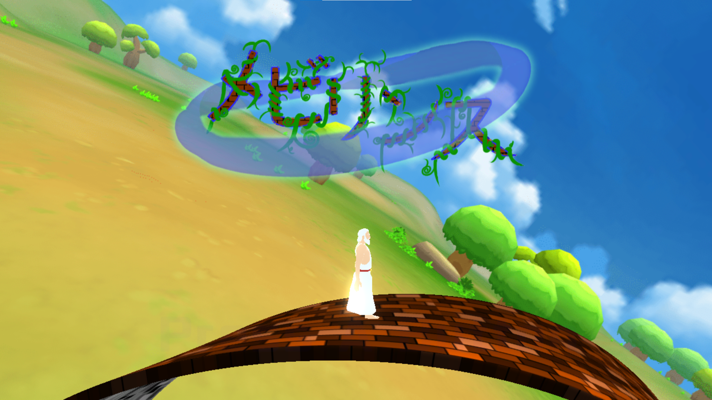
<br>

***

# 目次
- [目次](#目次)
- [1. 作品概要](#1-作品概要)
- [2. 担当ソースコード](#2-担当ソースコード)
- [3. 改造したエンジンコード](#3-改造したエンジンコード)
- [4. ゲーム内容](#4-ゲーム内容)
- [5. 操作説明](#5-操作説明)
  - [5.1. キーボード](#51-キーボード)
  - [5.2. Xbox 360 コントローラー](#52-xbox-360-コントローラー)
- [6. 技術紹介](#6-技術紹介)
  - [6.1. メビウスの輪の上の移動](#61-メビウスの輪の上の移動)
  - [6.2. メッシュとレイの交差点を求める](#62-メッシュとレイの交差点を求める)
  - [6.3. OBB同士の当たり判定](#63-obb同士の当たり判定)
  - [6.4. レベルデータの読み込み](#64-レベルデータの読み込み)
  - [6.5. ワイプ](#65-ワイプ)
  - [6.6. キューブマップスカイボックス](#66-キューブマップスカイボックス)
  - [6.7. 川瀬式ブルーム](#67-川瀬式ブルーム)
  - [6.8. VSM（分散シャドウマップ）](#68-vsm分散シャドウマップ)
  - [6.9. アウトライン描画](#69-アウトライン描画)
  - [6.10. リムライトを使ったこのゲーム専用のシェーディング](#610-リムライトを使ったこのゲーム専用のシェーディング)
- [7. ゲーム的にこだわったところ](#7-ゲーム的にこだわったところ)
  - [7.1 透明アイテムの表現](#71-透明アイテムの表現)
  - [7.2 メビウスの輪の上での移動以外の動き](#72-メビウスの輪の上での移動以外の動き)
  - [7.3 多彩なギミック](#73-多彩なギミック)
- [8. 日本ゲーム大賞2021「アマチュア部門」応募時と、U-22プログラミングコンテスト2021応募時の内容比較](#8-日本ゲーム大賞2021アマチュア部門応募時とu-22プログラミングコンテスト2021応募時の内容比較)
  - [8.1. 比較内容１（追加機能）](#81-比較内容１追加機能)
    - [8.1.1. ステージごとにスカイキューブマップの変更](#811-ステージごとにスカイキューブマップの変更)
    - [8.1.2. IBLの追加](#812-iblの追加)
    - [8.1.3. ディファードレンダリングとフォワードレンダリングのハイブリッドレンダリングエンジンの追加](#813-ディファードレンダリングとフォワードレンダリングのハイブリッドレンダリングエンジンの追加)
  - [8.2. 比較内容２（リファクタリング）](#82-比較内容２リファクタリング)
    - [8.2.1. マジックナンバーの取り除き](#821-マジックナンバーの取り除き)
    - [8.2.2. namespaceの追加](#822-namespaceの追加)
    - [8.2.3. 変数の初期化](#823-変数の初期化)
    - [8.2.4. 暗黙の型変換をなくす](#824-暗黙の型変換をなくす)
    - [8.2.5. 処理の長い関数の分割](#825-処理の長い関数の分割)
    - [8.2.6. dynamic_castによるダウンキャストの取り除き](#826-dynamic_castによるダウンキャストの取り除き)

***

# 1. 作品概要
* タイトル
  * メビリンス
* 学校
  * 河原電子ビジネス専門学校
* 制作人数
  * 3人
* 制作期間
  * 2021年2月～2021年5月（日本ゲーム大賞2021「アマチュア部門」　用期間）
  * 2021年5月～2021年8月（U-22プログラミングコンテスト2021　用期間）
* ゲームジャンル
  * パズルゲーム
* プレイ人数
  * 1人
* 対応ハード
  * PC Windows10
    * キーボード
    * Xbox 360 コントローラー
* 使用言語
  * C++
  * HLSL
* 開発環境
  * エンジン
    * 学校内製の簡易エンジン(DirectX12)
  * プログラム
    * Visual Studio 2019
  * 3Dモデル
    * 3ds MAX
  * エフェクト
    * Effeckseer
  * 画像
    * Adobe Photoshop
  * バージョン管理
    * Git Hub
  * タスク管理
    * Redmine
  * 連絡
    * Slack
* GitHubURL
  * [https://github.com/yonema/MyGame](https://github.com/yonema/MyGame)
* 備考
  * 日本ゲーム大賞2021「アマチュア部門」に応募
  * 日本ゲーム大賞2021「アマチュア部門」一次審査通過
  * U-22プログラミング・コンテスト2021に応募

<div style="text-align: right;">
<br>

[目次へ](#目次)
</div>

***

# 2. 担当ソースコード

* cppファイル、hファイル
  * Bloom.cpp
  * Bloom.h
  * CapacityUI.cpp
  * CapacityUI.h
  * CommonData.h
  * DirectionLight.cpp
  * DirectionLight.h
  * FontRender.cpp
  * FontRender.h
  * FrontOrBackData.h
  * FrontSideOrBackSideData
  * Game.cpp
  * Game.h
  * GameCamera.cpp
  * GameCamera.h
  * GameCameraConstData.h
  * GameObjectNameData.h
  * GameTime.cpp
  * GameTime.h
  * HUD.cpp
  * HUD.h
  * HUDConstData.h
  * InOrOutConstData.h
  * LeftOrRightData.h
  * Level.cpp
  * Level.h
  * LevelObjectBase.cpp
  * LevelObjectBase.h
  * LevelObjectManager.cpp
  * LevelObjectManager.h
  * LightData.h
  * LightManager.cpp
  * LightManager.h
  * main.cpp
  * MapChip.cpp
  * MapChip.h
  * MapChip2D.cpp
  * MapChip2D.h
  * Mobius.cpp
  * Mobius.h
  * ModelRender.cpp
  * ModelRender.h
  * ModelRenderConstData.h
  * MyCharacterController.cpp
  * MyCharacterController.h
  * Noncopyable.h
  * OBB.cpp
  * OBB.h
  * OBBConstData.h
  * OBBWorld.cpp
  * OBBWorld.h
  * ObjectType.h
  * ObstacleObject.cpp
  * ObstacleObject.h
  * OObox.cpp
  * OObox.h
  * OOflame.cpp（一部）
    * サウンドとエフェクトの処理以外を担当
  * OOflame.h（一部）
    * サウンドとエフェクトの処理以外を担当
  * OOgoal.cpp
  * OOgoal.h
  * OOoneway.cpp
  * OOoneway.h
  * OOpadlock.cpp
  * OOpadlock.h
  * OOReverseALL.cpp
  * OOReverseALL.h
  * OOsFilepathAndObbSizeConstData.h
  * OOTransparentSwitch.cpp（一部）
    * ChangeEntity(),ChangeTransparent()関数以外を担当
  * OOTransparentSwitch.h（一部）
    * ChangeEntity(),ChangeTransparent()関数以外を担当
  * OOwall.cpp（一部）
    * サウンドの処理以外を担当
  * OOwall.h（一部）
    * サウンドの処理以外を担当
  * Pause.cpp（一部）
    * スプライト表示処理以外を担当
  * Pause.h（一部）
    * スプライト表示処理以外を担当
  * Player.cpp（一部）
    * アニメーション再生処理以外を担当
  * Player.h（一部）
    * アニメーション再生処理以外を担当
  * PlayerConstData.h
  * PointLight.cpp
  * PointLight.h
  * PostEffect.cpp
  * PostEffect.h
  * PriorityData.h
  * resource.h（一部）
    * ウィンドウのゲームアイコン用のマクロを担当
  * ReversibleObject.cpp（一部）
    * CheckObjectsOverlap()関数以外を担当
  * ReversibleObject.h（一部）
    * CheckObjectsOverlap()関数以外を担当
  * ReversibleObjectConstData.h
  * ROkey_padlock.cpp
  * ROkey_padlock.h
  * ROleft_right.cpp
  * ROleft_right.h
  * ROnail_hammer.cpp
  * ROnail_hammer.h
  * ROrunning_stop.cpp
  * ROrunning_stop.h
  * ROsFilepathConstData.h
  * ROwater_fire.cpp（一部）
    * サウンドとエフェクトの処理以外を担当
  * ROwater_fire.h（一部）
    * サウンドとエフェクトの処理以外を担当
  * Save.cpp
  * Save.h
  * ShadowMap.cpp
  * ShadowMap.h
  * ShadowModel.cpp
  * ShadowModel.h
  * Sky.cpp
  * Sky.h
  * SoundCue.cpp
  * SoundCue.h
  * SpotLight.cpp
  * SpotLight.h
  * SpriteRender.cpp
  * SpriteRender.h
  * SpriteRenderConstData.h
  * Stage.cpp
  * Stage.h
  * stage_title.cpp
  * stage_title.h
  * StageBase.cpp
  * StageBase.h
  * StageBaseConstData.h
  * StartDirectingConstData.h
  * stdafx.h（一部）
    * 共通データヘッダーのインクルード
  * Tips.cpp
  * Tips.h
  * TipsController.cpp
  * TipsController.h
  * Title.cpp（一部）
    * スプライト表示処理以外を担当
  * Title.h（一部）
    * スプライト表示処理以外を担当
  * TitleConstData.h
  * TitleNameData.h
  * TopOrDownData.h
  * UFO.cpp
  * UFO.h
  * UFOLandingPoint.cpp
  * UFOLandingPoint.h
* fxファイル
  * DrawShadowMap.fx
  * model2.fx
  * PBR.fx
  * PostEffect.fx
  * SkyCubeMap.fx
  * sprite.fx（一部）
    * mulColor処理を担当
  * ufoLight.fx
  * Wipe.fx
  * ZPrepass.fx
* 全てのファイルのリファクタリングを担当

<div style="text-align: right;">
<br>

[目次へ](#目次)
</div>

***

# 3. 改造したエンジンコード

* cppファイル、hファイル
  * GraphicsEngine.cpp
    * UseMainRenderTarget関数追加（564行目～）
    * WaitDrawingMainRenderTarget関数追加（580行目～）
    * HUDRende関数追加（590行目～）
    * CopyToFrameBuffer関数追加（603行目～）
    * ClearZPrepassModels関数追加（644行目～）
    * ZPrepass関数追加（618行目～）
    * InitMainRenderTarget関数追加（70行目～）
    * InitCopyToFrameBufferSprite関数追加（90行目～）
    * InitZPrepassRenderTarget関数追加（112行目～）
  * GraphicsEngine.h
    * データメンバ、メンバ関数宣言、インラインメンバ関数の追加（327行目～475行目）
  * Material.cpp
    * InitFromTkmMaterila関数にカリングモードを設定できるように機能追加（57行目、87行目）
    * InitPipelineState関数にカリングモードを設定できるように機能追加（90行目、121行目）
  * Material.h
    * InitFromTkmMaterilaの関数宣言にカリングモードの引数追加（13行目）
    * InitPipelineStateの関数宣言にカリングモードの引数追加（81行目）
  * MeshParts.cpp
    * InitFromTkmFile関数にカリングモードと拡張用の定数バッファと拡張用のシェーダーリソースビューを設定できるように機能追加。（21行目～）
    * CreateDescriptorHeaps関数に拡張用の定数バッファと拡張用のシェーダーリソースビューを設定できるように機能追加（71行目～）
    * CreateMeshFromTkmMesh関数にカリングモードを設定できるように機能追加（113行目、176行目）
    * Draw関数に拡張用の定数バッファの更新処理と、共通定数バッファの追加したデータの更新処理の機能追加（203行目～）
  * MeshParts.h
    * InitFromTkmFileの関数宣言にカリングモードの引数追加（43行目）
    * CreateMeshFromTkmMeshの関数宣言にカリングモードの引数追加（156行目）
    * Drawの関数宣言にシャドウレシーバーフラグの引数追加（64行目）
  * Model.cpp
    * ビュー行列、プロジェクション行列を指定して描画するDraw関数のオーバーロードを追加（96行目～）
    * InIntersectLine()関数の追加（113行目～）
  * Model.h
    * ビュー行列、プロジェクション行列を指定して描画するDraw関数のオーバーロードを宣言（66行目）
    * データメンバ、メンバ関数宣言、インラインメンバ関数の追加（122行目～205行目）
  * Skeleton.cpp
    * InitLevel関数の追加（56行目～）
    * BuildBoneMatricesLevel関数の追加（138行目～）
  * Skeleton.h
    * データメンバのm_tklFileの追加。（268行目）
    * InitLevel関数の宣言（186行目）
    * BuildBoneMatricesLevel関数の宣言（206行目）


<div style="text-align: right;">
<br>

[目次へ](#目次)
</div>

***

# 4. ゲーム内容
&emsp;男性キャラクターがメビウスの輪のステージで、アイテムを裏側に投げて性質を反転させ、その性質を使ってゴールを目指すパズルゲーム。

<br>

<br>

<div style="text-align: right;">
<br>

[目次へ](#目次)
</div>

***

# 5. 操作説明
## 5.1. キーボード
* ステージ選択画面、ポーズ画面
  * Zキー：決定
  * Xキー：戻る
  * 十字キー：選択カーソルの移動
* ゲーム画面
  * Zキー：物を持つ（持った状態の場合→反対側に投げる）
  * Xキー：物を持った状態で→その場に置く
  * SHIFTキー：ダッシュ
  * ESCAPEキー：ポーズ画面を開く、閉じる
  * 十字キー：移動
## 5.2. Xbox 360 コントローラー
* ステージ選択画面、ポーズ画面
  * Aボタン：決定
  * Bボタン：戻る
  * 左スティック：選択カーソルの移動
* ゲーム画面
  * Aボタン：物を持つ（持った状態の場合→反対側に投げる）
  * Bボタン：物を持った状態で→その場に置く
  * Rボタン：ダッシュ
  * STARTボタン：ポーズ画面を開く、閉じる
  * 左スティック：移動


<br>

<br>

<div style="text-align: right;">
<br>

[目次へ](#目次)
</div>

***

# 6. 技術紹介

## 6.1. メビウスの輪の上の移動
&emsp;メビウスの輪の上を移動するには、重力の方向も移動する方向も常に一定ではないので、普通の移動では難しい。よって私は**ウェイポイント**を使ってメビウスの輪の上の移動を実装した。ここでいうウェイポイントとは位置情報と回転情報を保持したデータのことを指す。そのウェイポイントをメビウスの輪の上に配置する。このゲームでは32個のウェイポイントが配置されている。

<br>
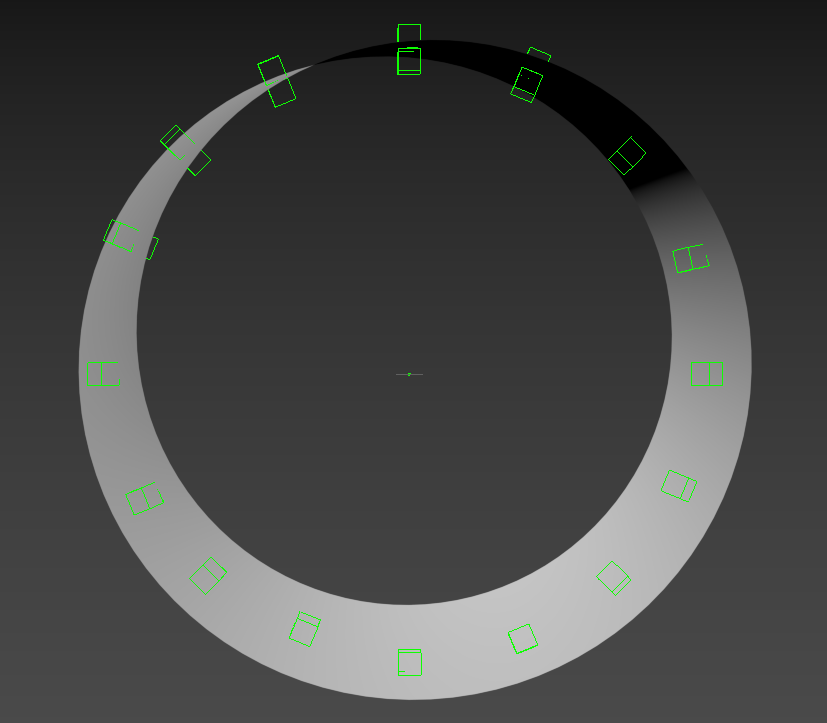
<br>

そして以下の手順で移動する。

1. ウェイポイントのデータを順番に番号を割り振って読み込む。
2. プレイヤーが何番のウェイポイントと何番のウェイポイントの間にあるか調べる。
3. プレイヤーが右に進むときは右にあるウェイポイントにむかって進む。
4. プレイヤーの回転は、左右のウェイポイントの回転情報を球面線形補完をして計算する。
5. ウェイポイントを通り過ぎたら次のウェイポイントへ番号を変更する。

&emsp;しかし、この方法ではウェイポイントの間を直線的に移動することしかできない。さらに地面からも離れている。そうではなくメビウスの輪に沿って移動して欲しい。

<br>
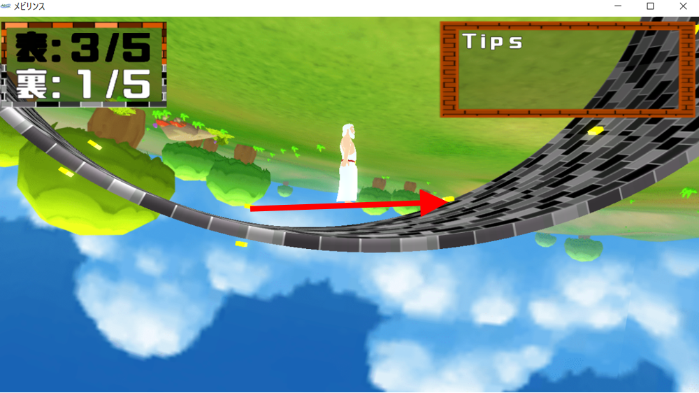
<br>

&emsp;そのため、下向きのベクトルを補完済みの回転情報で回転させ、その方向にプレイヤーからレイを飛ばし、レイとメビウスの輪の交差点を求め（次項の[*4.2.メッシュとレイの交差点を求める*](#42-メッシュとレイの交差点を求める)で説明）、その座標をプレイヤーの座標とすることでメビウスの輪に沿った移動にする。

<br>
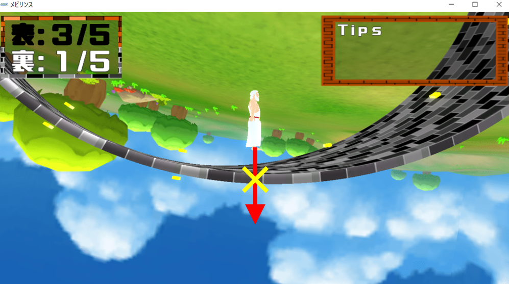
<br>
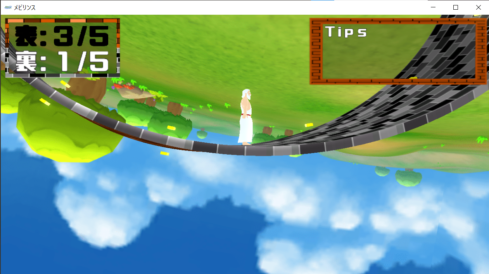
<br>

つまり最終的な手順は
1. ウェイポイントのデータを順番に番号を割り振って読み込む。
2. プレイヤーが何番のウェイポイントと何番のウェイポイントの間にあるか調べる。
3. プレイヤーが右に進むときは右にあるウェイポイントにむかって進む。
4. プレイヤーの回転は、左右のウェイポイントの回転情報を球面線形補完をして計算する。
5. プレイヤーから下向きにレイを飛ばしてメビウスの輪との交差点をプレイヤーの座標にする。
6. ウェイポイントを通り過ぎたら次のウェイポイントへ番号を変更する。

となる。

<div style="text-align: right;">
<br>

[目次へ](#目次)
</div>

## 6.2. メッシュとレイの交差点を求める

&emsp;メッシュとレイの交差点を求めるには以下の処理手順で計算する。

1. 三角形ポリゴンを含む無限平面とレイ（線分）の交差判定。
2. 交差している座標の計算。
3. 2で求めた交差点の座標が三角形の中にあるかどうか判定。
4. メッシュの三角形ポリゴン全てに1~3の処理を行う。その中で、複数の交差点が存在したら、レイの始点から一番近い座標を交差点とする。
5. 交差点が存在しなければ、交差していない。

それぞれ手順を詳しくみていく。

1. **「三角形ポリゴンを含む無限平面と線分（レイ）の交差判定。」**
   1. メッシュから三角形ポリゴンを一つ取り出して、三つの頂点の内どれか一つの頂点の座標、その頂点の法線（正規化済み）、レイの始点、レイの終点の四つのデータを使う。
   
      <br>
      
      <br>

   2. 頂点座標からレイの始点へのベクトル**vertToStartVec**、頂点座標からレイの終点へのベクトル**vertToEndVec**の二つのベクトルを求め、それぞれ正規化しておく。
   
      <br>
      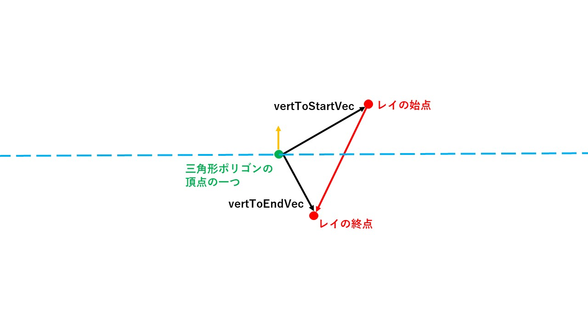
      <br>

   3. 頂点の法線と正規化されたvertToStartVecの内積**normAndStartDot**と、頂点の法線と正規化されたvertToEndVecの内積**normAndEndDot**を求める。
      
      <br>
      
      <br>

   4. normAndStartDotとnormAndEndDotの*積が負の値だったら*無限平面と交差しているので次の工程へ。0以上の値だったら交差していないので次の三角形ポリゴンを調べる。
      * 二つの内積の値の組み合わせが正と負のときに、無限平面とレイが交差してる。それ以外の正と正、負と負のときは交差していない。

      <br>
      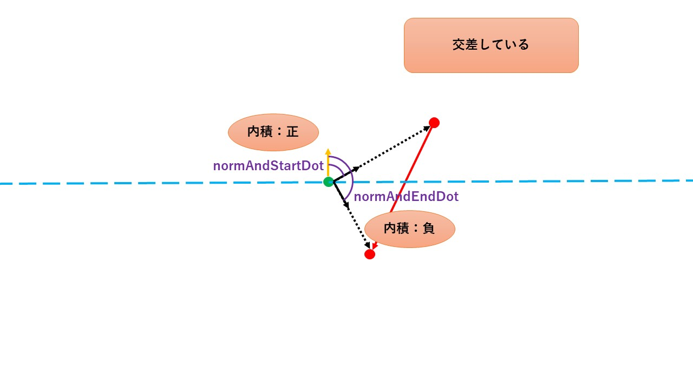
      <br>
      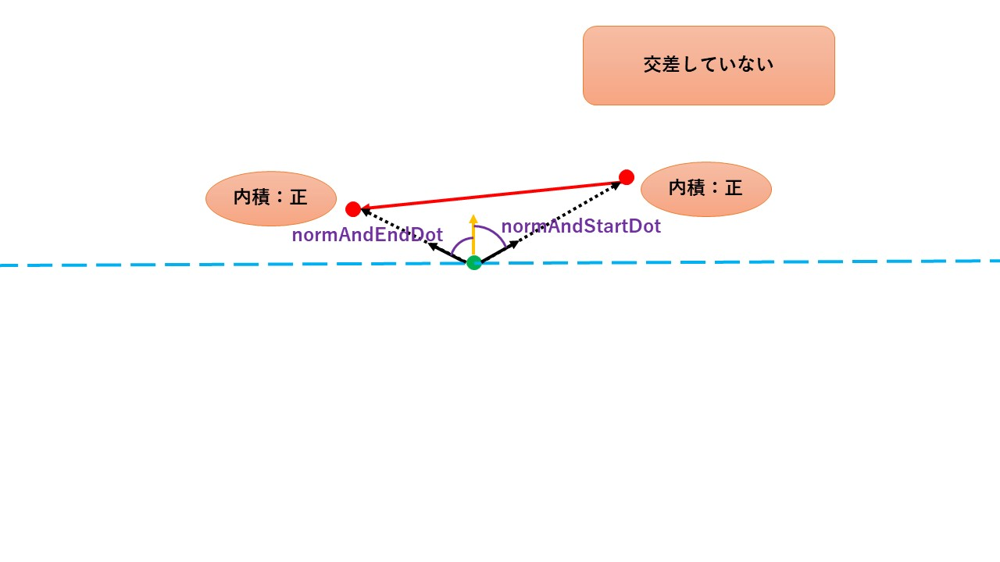
      <br>
      
      <br>
        
2. **「交差している座標の計算。」**
   1. 無限平面とレイの交点とレイを使って図のような三角形を二つ作る。この二つの三角形は相似のため対応する辺の比が等しい。レイの始点と終点の座標は分かっているので、辺の比が分かれば無限平面とレイの交点の座標が求めることができる。
   
      <br>
      
      <br>

      辺の比を求めるために下の図の場所の辺の長さを調べる。

       <br>
       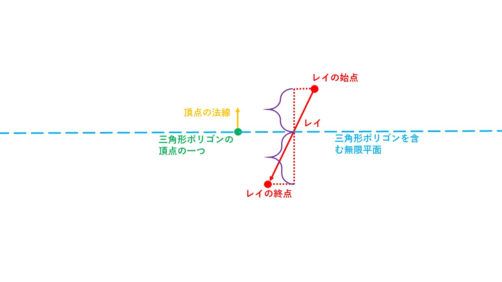
       <br>

   2. 辺の長さを調べるために、まず三角形のどれか一つの頂点座標からレイの始点へのベクトルと**vertToStartVec**、頂点座標からレイの終点へのベクトル**vertToEndVec**の二つのベクトルを求める。今回は正規化しない。そして反転した頂点の法線も求めておく。
   
      <br>
      
      <br>

   3. 頂点の法線とvertToStartVecの内積**normAndStartDot**と、反転した頂点の法線とvertToEndVecの内積**normAndEndDot**を求める。これで頂点の法線に射影したvertToStartVecの長さと、反転した頂点の法線に射影したvertToEndVecの長さを求めることができる。
   
      <br>
      
      <br>

   4. この二つの長さは、図の位置の辺の長さと等しい。つまり、この二つの三角形の相似比は**normAndStartDot : normAndEndDot**になる。
   
      <br>
      
      <br>

   5. 相似比が分かったので、レイの始点から終点へのベクトル**startToEndVec**を求めて normAndStartDot / (normAndStartDot + normAndEndDot) を掛けるとレイの始点から交点までのベクトル**startToIntersectVec**が求まる。
   
      <br>
      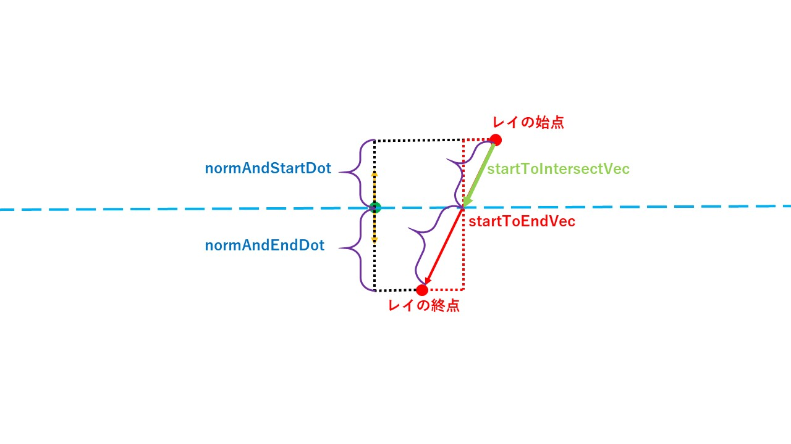
      <br>

   6. レイの始点とstartToIntersectVecの和が無限平面とレイの交差点の座標になる。
   
      <br>
      
      <br>

3. **「2で求めた交差点の座標が三角形の中にあるかどうか判定。」**
   1. 今までは三角形ポリゴンを真横から見て考えていたが、次は真上から見て考える。2で求めた交差点の座標と、三角形ポリゴンの頂点座標三つのデータを使う。
   
      <br>
      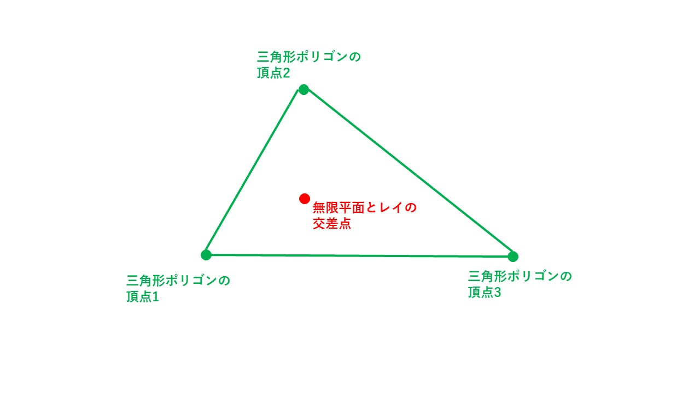
      <br>

   2. 三角形の頂点それぞれから無限平面とレイの交差点へのベクトル**vert1~3ToIntersectVec**を求める。そして三角形を時計回りに回るように、頂点1から頂点2へのベクトル**vert1ToVert2Vec**、頂点2から頂点3へのベクトル**vert2ToVert3Vec**、頂点3から頂点0へのベクトル**vert3ToVert1Vec**を求める。
   
      <br>
      
      <br>

   3. 三角形の頂点それぞれから伸びている二つベクトルを、終点が交点の方のベクトル（vert1~3ToIntersectVec）、もう一方のベクトル、の順番で外積を求める**cross1~3**。そして、それぞれ正規化しておく。
   
      <br>
      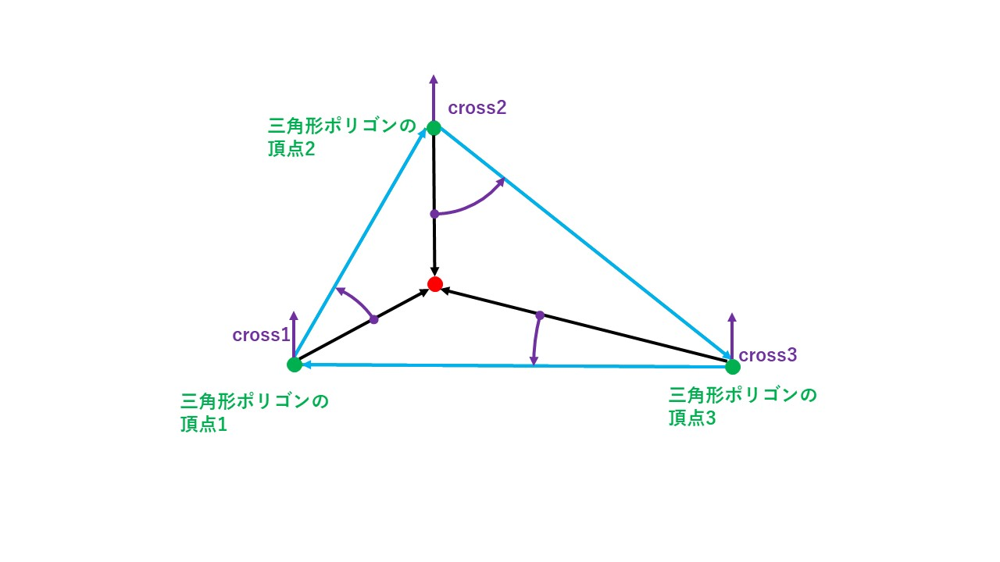
      <br>

   4. cross1とcorss2の内積**dot1**、cross1とcross2の内積**dot2**を求める。dot1とdot2が*両方正の値だったら*交点が三角形の中にあるため、レイと三角形ポリゴンが交差している。
      * 交点が三角形の中にあるときは三つの外積の値cross1~3がどれも同じ方向になる。
  
      <br>
      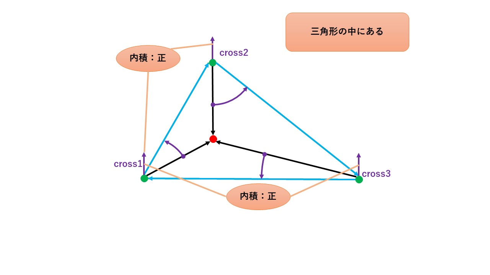
      <br>
      
      <br>

4. **「メッシュの三角形ポリゴン全てに1~3の処理を行う。その中で、複数の交差点が存在したら、レイの始点から一番近い座標を交差点とする。」**
   * レイと三角形ポリゴンが複数交差している場合があるので、今回の場合ではレイの始点から一番近い座標を交差点とする。

5. **「交差点が存在しなければ、交差していない。」**
   * 三角形ポリゴン全てを調べて、どれともレイが交差していなければ、このメッシュとレイは交差していない。

<div style="text-align: right;">
<br>

[目次へ](#目次)
</div>

## 6.3. OBB同士の当たり判定
* OBB同士の当たり判定では [OBBとOBBの衝突](http://marupeke296.com/COL_3D_No13_OBBvsOBB.html "OBBとOBBの衝突") のサイトを参考にした。
* OBBとは**Oriented Bounding Box**(oriented:指向性の、方向づけられた)のことで、簡単に言うと回転できるAABB。
* OBB同士の当たり判定は、いろんな直線（分離軸）に二つのOBBの形を射影して、一つ一つ重なっていないか調べていくことで判定する。
* 以下の処理手順で行う。

1. 分離軸を探す。
2. 分離軸に二つのOBBを射影して射影線分を作る。
3. 二つの射影線分が重なっていないか調べる。
4. 1~3の処理を全ての分離軸で調べる。重なっていない射影線分が一つでもあれば衝突していないので処理を抜ける。
5. 全ての分離軸で重なっていたら衝突している。

それぞれ手順を詳しくみていく。

1. **「分離軸を探す。」**
   * 3D空間のOBBの分離軸は、片方のOBBの単位方向ベクトル3本、他方のOBBの単位方向ベクトル3本、双方の単位方向ベクトルに垂直な分離軸3x3=9本の計15本が必要になる。
   * 双方の単位方向ベクトルに垂直な分離軸は双方の単位方向ベクトルの外積で求めることができる（その後正規化する）。
   
      <br>
      
      <br>
      
2. **「分離軸に二つのOBBを射影して射影線分を作る。」**
   * 分離軸は単位ベクトルなので、ベクトルと内積を取ると射影線分を求めることができる。だから分離軸と、OBBのそれぞれ大きさ付の方向ベクトルのとの内積の絶対値を合計すると射影線分の半分の長さが求まる。
   * 分離軸が自身の単位方向ベクトルの時は、大きさ付の方向ベクトルの大きさがそのまま射影線分の半分の長さとなる。
  
      <br>
      
      <br>

3. **「二つの射影線分が重なっていないか調べる。」**
   * OBB同士の中心点の距離が、双方の射影線分の半分の長さの和より大きいときは、重なっていないので衝突していない。
   * OBB同士の中心点の距離が、双方の射影線分の半分の長さの和より小さいときは、重なっているので、この分離軸では衝突している。
  
     <br>
     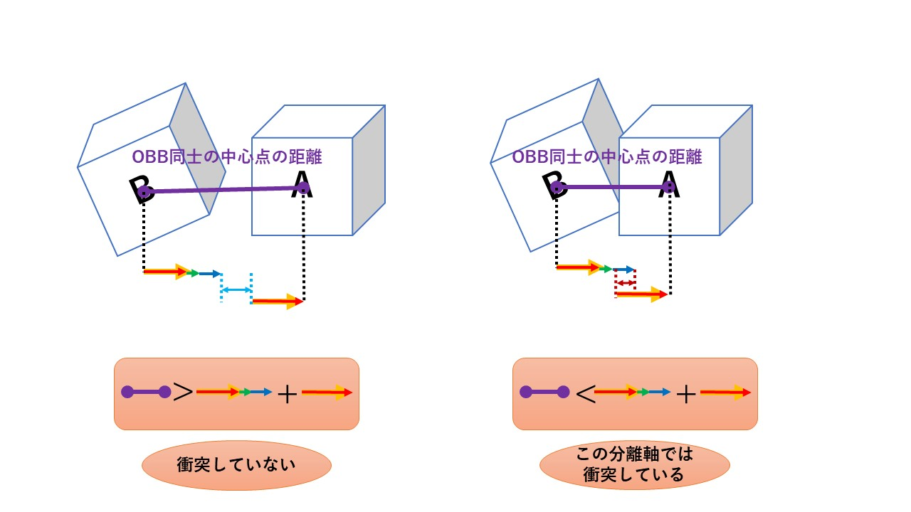
     <br>

4. **「1~3の処理を全ての分離軸で調べる。重なっていない射影線分が一つでもあれば衝突していないので処理を抜ける。」**
   * 15本の分離軸全てで1~3の処理を行い、どこからみても確実に衝突しているか調べる。
   * 途中で、射影線分が重なっていない場合、つまり、OBB同士の中心点の距離が、双方の射影線分の半分の長さの和より大きいときがあれば確実に衝突していないので、処理を抜ける。

5. **「全ての分離軸で重なっていたら衝突している。」**
   * どこからみても射影線分が重なっているので、このOBB同士は衝突していると確定する。

<div style="text-align: right;">
<br>

[目次へ](#目次)
</div>

## 6.4. レベルデータの読み込み
   * レベルデータとは、モデリングソフト上で配置したモデル達の名前や座標などが保存されたデータのこと。学校から、3ds MAXで配置したレベルデータをtklファイルとして出力するエクスポーターが提供されている。
   * レベルデータを使用すると、デフォルトの処理では、モデリングソフト上で配置された通りの場所に、モデルと静的物理オブジェクトが生成される。
   * こと時フック関数が指定されていたら、その関数を呼び出す。

このtklファイルを以下の処理手順で読み込んでいく。
  
  1. tklファイルを読み込む。
  2. 読み込んだオブジェクト達のデータの、オブジェクト一つずつ取り出してデータを見ていく。
  3. オブジェクトの座標、回転、拡大率、オブジェクトネーム、のデータを取得する。
  4. このときフック関数が指定されている時はフック関数を呼び出す。このときフック関数の引数に、取り出したオブジェクトのデータを渡す。
  5. フック関数が指定されていない時、またはフック関数の戻り値がfalseだった場合、デフォルトの処理を行う。
  6. デフォルトの処理
     1. モデルデータのアセットを入れておくディレクトリから、オブジェクトネームと同じ名前のモデルを生成する。モデルがなかったらエラーを出す。
     2. モデルが生成できたら、静的物理オブジェクトをオブジェクトのメッシュの形から生成する。
  7. 全てのオブジェクトデータ分、2～6を繰り返す。

<div style="text-align: right;">
<br>

[目次へ](#目次)
</div>

## 6.5. ワイプ
&emsp;レベル遷移時に急に場面が切り替わるのではなく、ワイプで画像を表示してから、見えないように画像の後ろでレベル遷移を行うようにしている。ワイプの種類は以下の5種類あり、ランダムでワイプするようになっている。

1. リニアワイプ
  
      <br>
      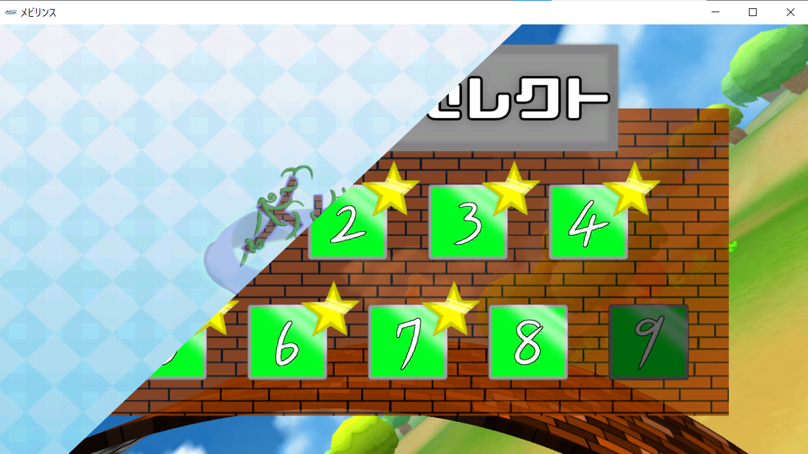
      <br>
      
   1. リニアワイプでは、CUP側（C++）とGPU側（HLSL）の両方の処理で行う。
   2. CPU側では、現在どのくらいワイプしているかの変数**wipeSize**、ワイプする方向**wipeDir**を用意し、GPUに渡すようにする。
   3. wipeSizeを毎フレーム加算することでワイプを進める。
   4. GPU側では、wipeDirと描画するピクセル座標の内積をとり、wipeDirに射影したピクセル座標の長さ**wipeProjLen**を求める。
   
      <br>
      
      <br>

   5. wipeProjLenがwipeSizeより大きかったら通常の描画をして、小さかったらワイプ用のスプライトを描画する。
   
      <br>
      
      <br>


2. 円形ワイプ

    <br>
    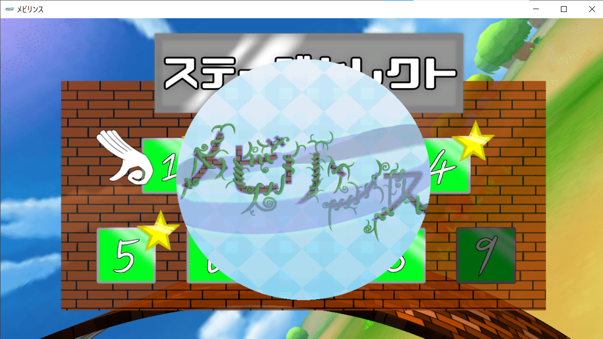
    <br>

   1. 円形ワイプでは、CUP側で、現在どのくらいワイプしているかの変数**wipeSize**を用意し、GPUに渡すようにする。
   2. wipeSizeを毎フレーム加算することでワイプを進める。
   3. GPU側では、画面中央からピクセル座標への距離**posFromCenter**を求める。
   4. posFromCenterがwipeSizeより大きかったら通常の描画をして、小さかったらワイプ用のスプライトを描画する。
   
      <br>
      
      <br>

3. 縦縞ワイプ

    <br>
    
    <br>

   1. 縦縞ワイプでは、CUP側で、現在どのくらいワイプしているかの変数**wipeSize**を用意し、GPUに渡すようにする。
   2. wipeSizeを毎フレーム加算することでワイプを進める.
   3. GPU側では、画面の横幅 / 分割したい数 で分割された一つ分の横幅**divideLength**を求める。
   4. ピクセル座標のX座標をdivideLengthで割った余り**dividedPos**を求める。これによって画面を縦に分割することができる。
   
      <br>
      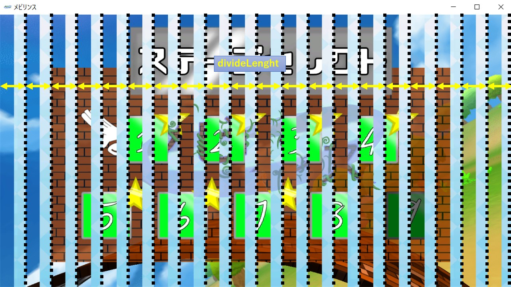
      <br>

   5. dividedPosがwipeSizeより大きかったら通常の描画をして、小さかったらワイプ用のスプライトを描画する。

      <br>
      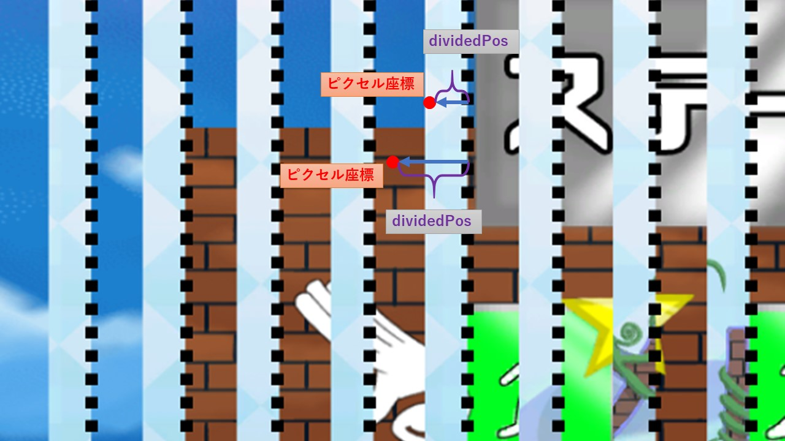
      <br>

4. 横縞ワイプ

    <br>
    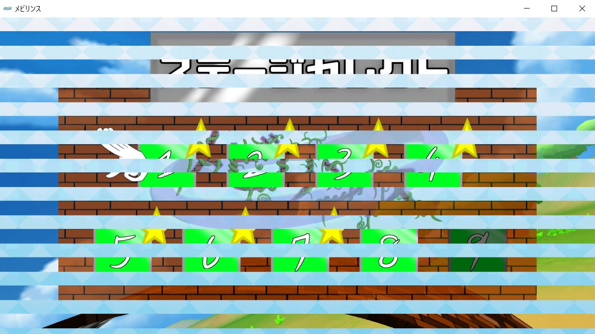
    <br>

   1. 先ほどの縦縞ワイプとほぼ同じ。横縞ワイプではCUP側で、現在どのくらいワイプしているかの変数**wipeSize**を用意し、GPUに渡すようにする。
   2. wipeSizeを毎フレーム加算することでワイプを進める.
   3. GPU側では、画面の縦幅 / 分割したい数 で分割された一つ分の縦幅**divideLength**を求める。
   4. ピクセル座標のY座標をdivideLengthで割った余り**dividedPos**を求める。これによって画面を横に分割できる。

      <br>
      
      <br>

   5. dividedPosがwipeSizeより大きかったら通常の描画をして、小さかったらワイプ用のスプライトを描画する。

      <br>
      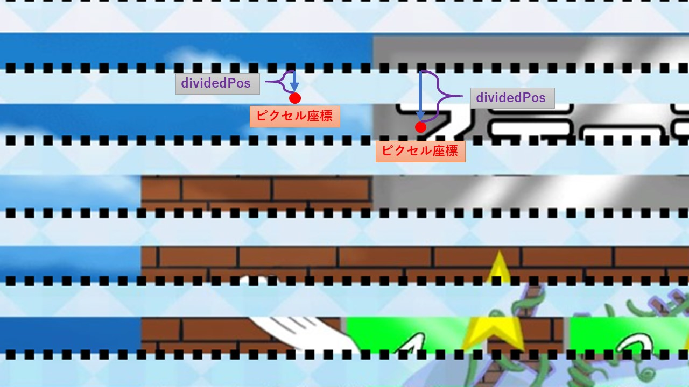
      <br>

5. チェッカーボードワイプ

    <br>
    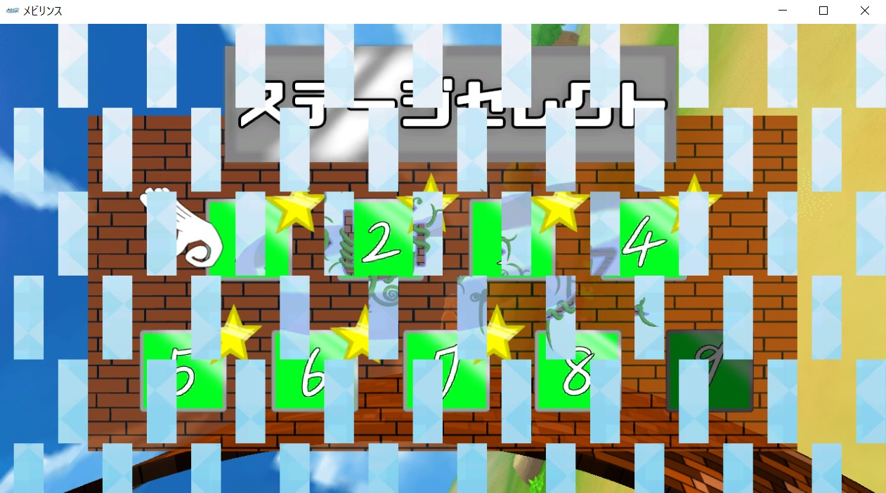
    <br>

   1. 縦縞と横縞のワイプを合わせたワイプ。チェッカーボードワイプではCUP側で、現在どのくらいワイプしているかの変数**wipeSize**を用意し、GPUに渡すようにする。
   2. wipeSizeを毎フレーム加算することでワイプを進める.
   3. GPU側では、画面の横幅 / 分割したい数 で分割された一つ分の横幅**divideLengthX**と、画面の縦幅 / 分割したい数 で分割された一つ分の縦幅**divideLengthY**を求める。
   4. まずは、縦分割から考えていく。ピクセル座標のY座標をdivideLengthYで割って、ピクセル座標が偶数段目にいるのか奇数段目にいるのか調べる。

      <br>
      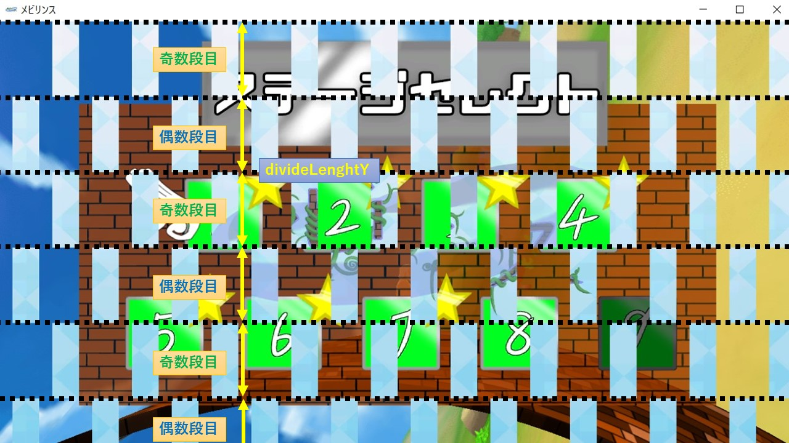
      <br>

   5. 次に、横分割を考える。偶数段目の時は普通の縦縞ワイプと同じようにする。奇数段目の時は、ピクセル座標のX座標をdivideLengthXの半分ずらして縦縞ワイプをさせる。

      <br>
      
      <br>
      
<div style="text-align: right;">
<br>

[目次へ](#目次)
</div>

## 6.6. キューブマップスカイボックス
&emsp;このゲームでは空の表現にキューブマップスカイボックスを使用している。キューブマップスカイボックスとは、空用の球体のモデルのピクセルカラーを、球体の法線の先にあるキューブマップのカラーにする、というものである。詳しい手順は以下の通りである。

1. キューブマップを用意する。キューブマップとは下の画像のように立方体の展開図のような形をした画像である。

    <br>
    
    <br>

2. 空用の球体のモデルのシェーダーリソースビューにキューブマップを登録する。この時D3D12_SHADER_RESOURCE_VIEW_DESCのViewDimensionをD3D12_SRV_DIMENSION_TEXTURECUBEにしなくてはいけない。
3. GPU側では、TextureCubeの型でキューブマップを受取って、球の法線を使ってサンプリングする。球の法線の先にあるキューブマップのテクスチャのカラーがそのピクセルのカラーになる。

    <br>
    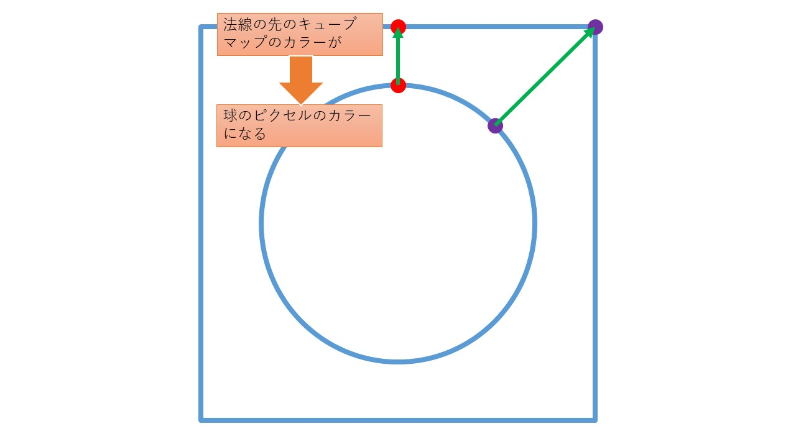
    <br>


<div style="text-align: right;">
<br>

[目次へ](#目次)
</div>

## 6.7. 川瀬式ブルーム
&emsp;ポストエフェクトの一つであるブルームを、川瀬正樹氏が発表した川瀬式ブルームを使用して実装した。<br>
&emsp;普通のブルームはレンダリング後の画面から輝度抽出し、明るい部分にガウシアンブラーをかけて、もとの画面に加算合成するものだ。しかし、このやり方だとある程度明るい光は全て同じ半径のブルームになってしまう。<br>
&emsp;一方、川瀬式ブルームはダウンサンプリングしながら複数回ガウシアンブラーをかけ、それらを平均化したものを元の画面に加算合成する。これにより大きい光はより大きい半径のブルームがかかるようになる。<br>
&emsp;詳しい手順は以下の通りである。

1. モデルなどを全てレンダリングする。
   
    <br>
    
    <br>

2. レンダリング後の画面から輝度抽出をする。

    <br>
    
    <br>

3. 輝度抽出したテクスチャをダウンサンプリングして、ガウシアンブラーをかけボケ画像を作る。ダウンサンプリングすると解像度が低くなるため、ガウシアンブラーの処理が軽くなる。（1280×720 -> 640×360）

    <br>
    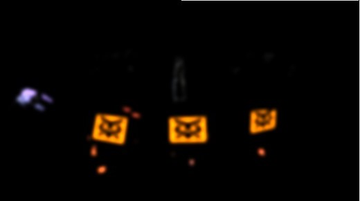
    <br>

4. 3.で作ったボケ画像を、さらにダウンサンプリングしてガウシアンブラーをかける。（640x360 -> 320x180）

    <br>
    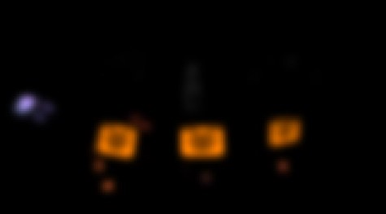
    <br>
  
5. 4.で作ったボケ画像を、さらにダウンサンプリングしてガウシアンブラーをかける。（320x180 -> 160x90）

    <br>
    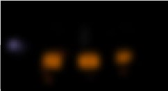
    <br>

6. 5.で作ったボケ画像を、さらにダウンサンプリングしてガウシアンブラーをかける。（160x90 -> 80x45）

    <br>
    
    <br>

7. 出来上がった四つのボケ画像を同じ解像度になるように拡大し、加算合成したあと平均を取り、それを描画する。

    <br>
    
    <br>

<div style="text-align: right;">
<br>

[目次へ](#目次)
</div>

## 6.8. VSM（分散シャドウマップ）
&emsp;VSM、分散シャドウマップとは、深度値のグループごとの局所的な分散を利用するソフトシャドウの一種である。深度値の局所的な分散が大きい場合、そのグループ内の深度値の幅が大きいということであり、つまり、影の境界線であることがわかる。影の境界線はジャギーが発生しやすいため、影を薄くするという手法。<br>

▼グループごとに分けたシャドウマップ
<br>
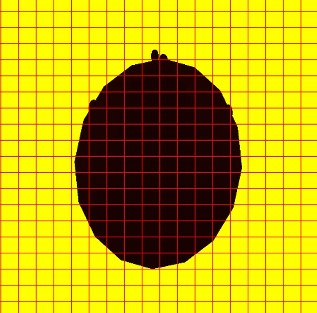
<br>

▼分散が大きいグループが影の境界線になる
<br>

<br>

詳しい手順は以下の通りである。

1. まず、シャドウマップを描画する。シャドウマップには**深度値**（ライトからピクセルまでの距離）と**深度値の二乗**を描き込む。深度値の二乗は分散を計算するときに使用する。

    <br>
    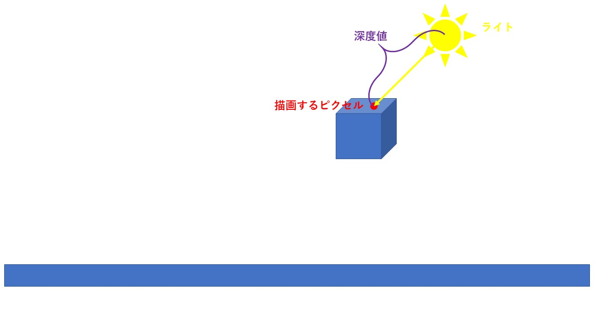
    <br>

2. シャドウマップをダウンサンプリングしながらガウシアンブラーを掛けて、ブロックごとのおおよその平均値を求める。これで局所的な**深度値の平均値**と、**深度値の二乗の平均値**を求めることができる。
3. ガウシアンブラーを掛けたテクスチャをシャドウマップとして、シャドウレシーバーのシェーダーリソースビューに登録する。
4. シャドウレシーバーで影の計算をする。
5. ピクセル座標をライトビュースクリーン空間からUV空間に変換して、UV空間の座標がXとYそれぞれ0.0f～1.0fの値におさまっているか調べる。範囲外の影は落とせない。（VSMの機能ではないため詳しい説明は割愛）
6. ライトビュースクリーン空間でのZ値がシャドウマップに描かれている深度値より大きかったら、ピクセルとライトの間に遮蔽物があるということになり、影を描画する。（デプスシャドウの機能。VSMの機能ではないため詳しい説明は割愛）
7. チェビシェフの不等式を使ってピクセルに光が届く確率を求める。まずは深度値の分散を求める。分散は「**二乗の平均 - 平均の二乗**」で計算できる。二乗の平均は、シャドウマップにすでに「深度値の二乗の平均値」が描かれている。平均の二乗は、シャドウマップの「深度値の平均値」を二乗することで求まる。二つの値の差で求めた分散の値を**variance**とする。

    <br>
    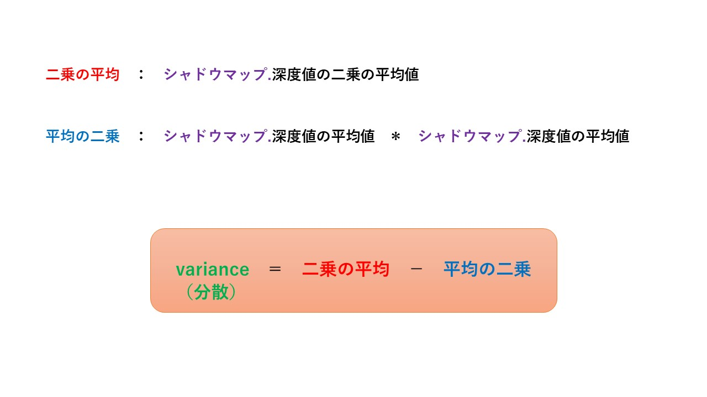
    <br>

8. ライトを遮っている座標から影までの距離を出すために、ライトビュースクリーン空間でのZ値からシャドウマップに描かれている「深度値の平均値」引いた値を求めて**md**とする。

    <br>
    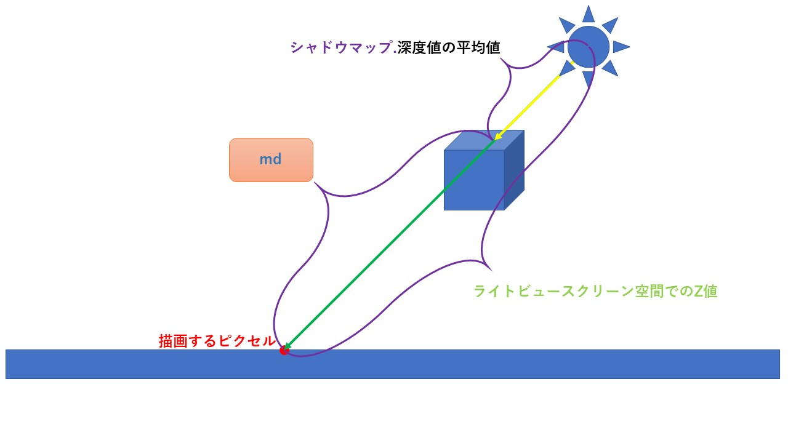
    <br>

9. varianceとmdの値を利用して光が届く確率**lit_factor**を計算する。計算式は以下の通りである。

```C
  float lit_factor = variance / (variance + md * md);
```

varianceとmdとlit_factorの関係性は以下の通りである。<br>

▼ **variance**と**fit_factor**の関係の表。（mdは0.5で固定）
| variance<br>分散 | variance / (variance + md * md)<br>計算式 | lit_factor<br>光が届く確率 |
| :- | :- | :- |
| 0.1 | 0.1 / (0.1 + 0.5 * 0.5) | 0.285714 |
| 0.5 | 0.5 / (0.5 + 0.5 * 0.5) | 0.666667 |
| 1.0 | 1.0 / (1.0 + 0.5 * 0.5) | 0.8 |
| 3.0 | 3.0 / (3.0 + 0.5 * 0.5) | 0.923077 |

<br>▼ **variance**と**fit_factor**の関係のグラフ。（mdは0.5で固定）
<br>
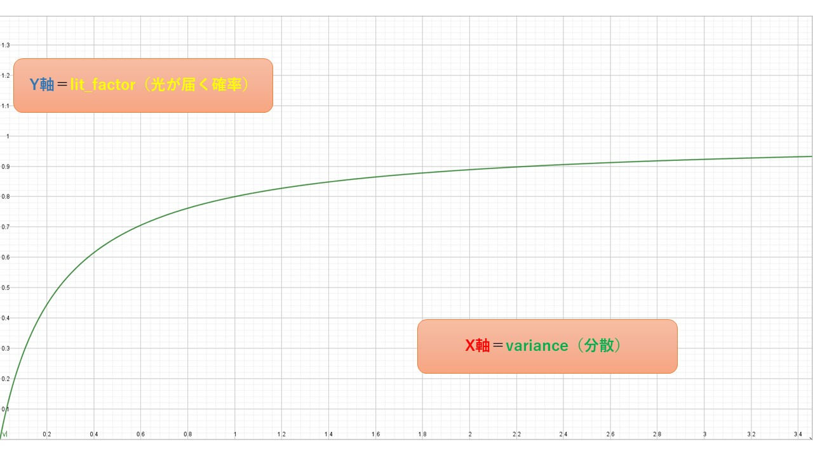
<br>

▼ **md**と**fit_factor**の関係の表。（varianceは0.5で固定）
| md | variance / (variance + md * md)<br>計算式 | lit_factor<br>光が届く確率 |
| :- | :- | :- |
| 0.1 | 0.5 / (0.5 + 0.1 * 0.1) | 0.980392 |
| 0.5 | 0.5 / (0.5 + 0.5 * 0.5) | 0.666667 |
| 1.0 | 0.5 / (0.5 + 1.0 * 1.0) | 0.333333 |
| 3.0 | 0.5 / (0.5 + 3.0 * 3.0) | 0.0526316 |

<br>▼ **md**と**fit_factor**の関係のグラフ。（varianceは0.5で固定）
<br>
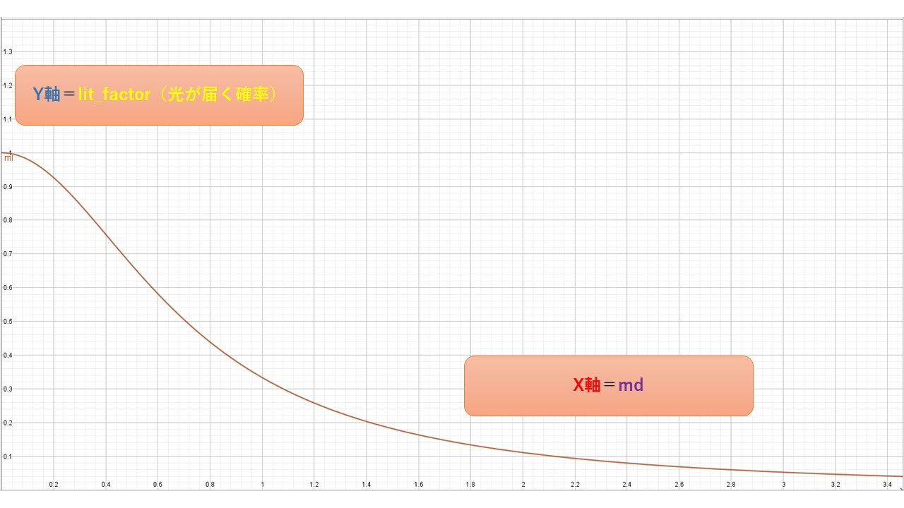
<br>

variance（分散）が大きくなるとlit_factor（光が届く確率）が増大し、mdが大きくなるとlit_factorが減少する。<br>
つまり、varianceが大きいほど影が薄くなり、小さいほど影が濃くなる。<br>
そして、mdが大きいほど影が濃くなり、小さいほど影が薄くなる。


<div style="text-align: right;">
<br>

[目次へ](#目次)
</div>

## 6.9. アウトライン描画
&emsp;このゲームはポップな世界観のため、それを表現するためにシェーダーでモデルにアウトラインを描画するようにした。<br>

▼アウトライン描画あり

   <br>
   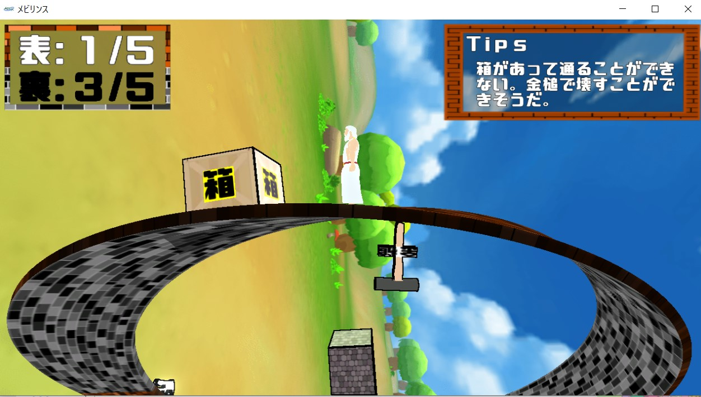
   <br>

▼アウトライン描画なし

   <br>
   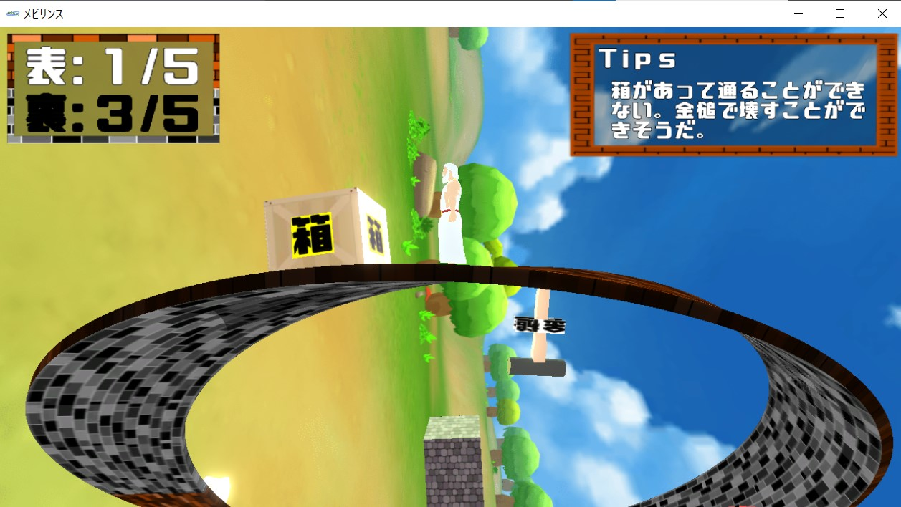
   <br>


描画するテクセルと近傍8テクセルの深度値や法線のデータを比べて、差が一定以上ある時はアウトラインを描画する。詳しい手順は以下の通りである。

1. モデルのプロジェクション空間での深度値と、法線をテクスチャに描き込む。
2. モデルを描画するときに1.で作ったテクスチャをデータを持ってくる。
3. 今から描画するテクセルの深度値と、近傍8テクセルの深度値の平均、この二つの差の絶対値が一定以上ならアウトラインを描画する。

    <br>
    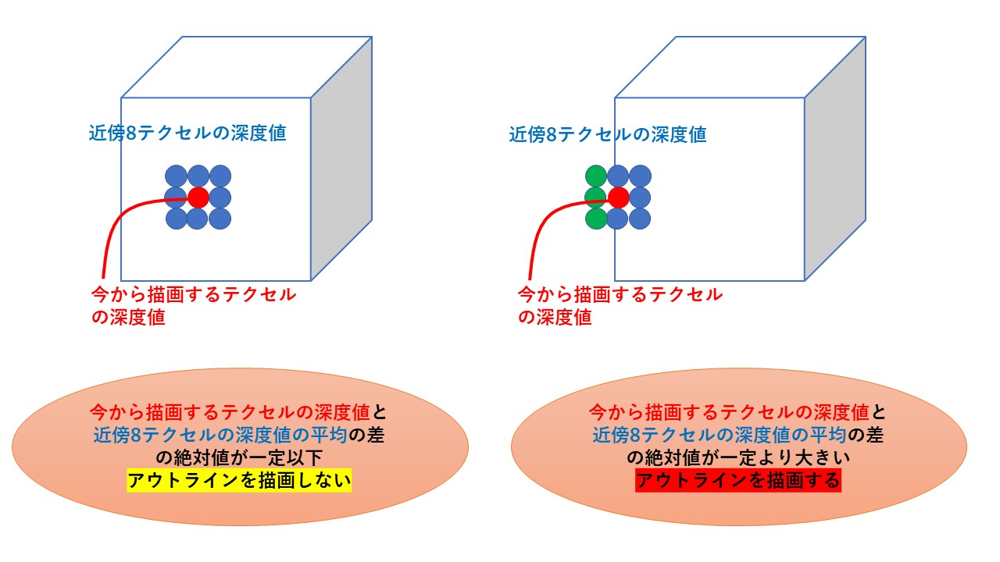
    <br>

4. また、深度値だけだとモデルの凹凸のアウトラインが、深度値の差が小さすぎるため、描画されない。

    <br>
    
    <br>

   そのため今から描画するテクセルの法線と、近傍8テクセルのそれぞれの法線とのどれかの内積が一定以下だったらアウトラインを描画する

    <br>
    
    <br>

<div style="text-align: right;">
<br>

[目次へ](#目次)
</div>

## 6.10. リムライトを使ったこのゲーム専用のシェーディング
&emsp;このゲームの世界観に合うように、シェーディングはリムライトの仕組みを利用して行っている。通常のリムライトとは違いライトの位置や方向は考慮せず、常にカメラから見た時のモデルの輪郭部分の光が強いようにしている。その光はキューブマップを利用して、空のカラーの光が少し映り込むようにしている。<br>
詳しい手順は以下の通りである。

1. アルベドカラーをサンプリングしてカラーを持ってくる。
2. 空のキューブマップを、モデルの法線を使ってサンプリングしてカラーを持ってくる。
3. 以下の式を使ってリムライトの強さを求める。

```c
float limPower = pow( 1.0f - abs(viewNormal.z), 5.0f );
```

1.0f - abs(viewNormal.z)で、カメラ空間での法線のZ成分の絶対値が大きいほど0.0fに、小さいほど1.0fに近づく値になる。その値をpowを使って光の強さを調節している。

4. キューブマップから持ってきたカラーに、今計算したlimPowerを掛ける。これで輪郭部分に近づくほど空のカラーが強く映り込むようになる。
5. アルベドカラーに4.の値を足して最終的なカラーにする。

<div style="text-align: right;">
<br>

[目次へ](#目次)
</div>

***

# 7. ゲーム的にこだわったところ

## 7.1 透明アイテムの表現
&emsp;スイッチを押すまで触ることのできない透明アイテム。その透明アイテムの表現をただモデルを半透明にして描画するのではなく、モデルを透明にし、アウトラインのみ描画した後、そのアウトラインを更にディザリングすることでユニークな表現にした。

<br>

<br>

## 7.2 メビウスの輪の上での移動以外の動き
* プレイヤーが炎と衝突した時、後方に飛び上がってから重力にしたがって落ちるような動きを入れている。

   <br>
   
   <br>

* アイテムを投げるときそのまま真下に投げると床を貫通してしまうため、手前側から回り込んで床の向こう側に行く。

   <br>
   
   <br>

* アイテムをその場において、他のアイテムと重なってしまったとき、重なりを解決するために、アイテムがクルクル回りながら横に弾かれる動きをする。

   <br>
   
   <br>

## 7.3 多彩なギミック
* **炎**：プレイヤーを通さない。水を三回当てると消火できる。

   <br>
   
   <br>

* **壁**：プレイヤーを通さない。稼働を当てると壁が動き出す。

   <br>
   
   <br>

* **全反転魔方陣**：通過すると、ステージにある全てのアイテムの性質が反転する。

   <br>
   
   <br>

* **スイッチと透明アイテム**：スイッチを押すと透明アイテムが実体化し、触れることができるようになる。一定時間で透明に戻り、元の位置に戻る。

   <br>
   
   <br>


<div style="text-align: right;">
<br>

[目次へ](#目次)
</div>

***

# 8. 日本ゲーム大賞2021「アマチュア部門」応募時と、U-22プログラミングコンテスト2021応募時の内容比較

&emsp;以下からは、日本ゲーム大賞2021「アマチュア部門」に応募した「メビリンス」とU-22プログラミング・コンテスト2021に応募した「メビリンス」の比較内容を記述する。

## 8.1. 比較内容１（追加機能）

### 8.1.1. ステージごとにスカイキューブマップの変更

&emsp;改変前はどのステージでも同じスカイキューブマップを使用していたが、ステージごとにスカイキューブマップを変更するようにした。最初の方のステージでは穏やかな空にし、ステージが進むに連れてより壮大な空に変更し、雰囲気が盛り上がるようにした。

▼改変前のスカイキューブマップ
<br>
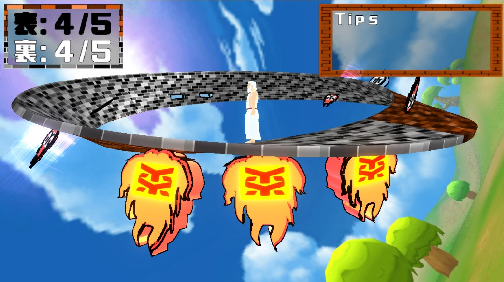
<br>

▼改変後のスカイキューブマップ<br>

▼ステージ1,2
<br>
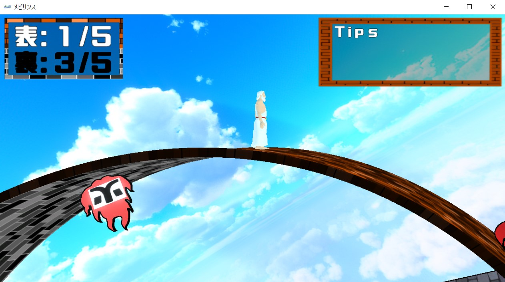
<br>


▼ステージ3,4
<br>
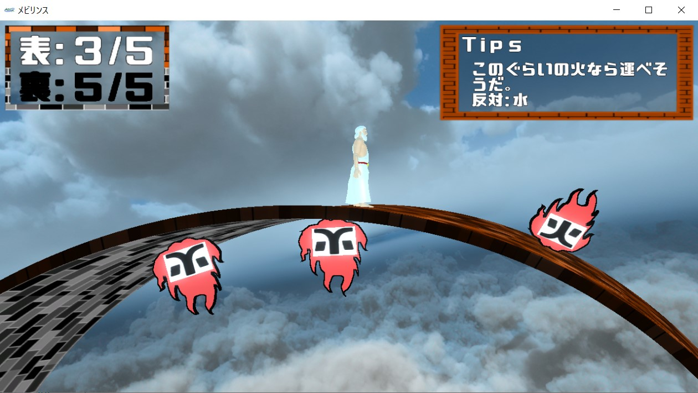
<br>


▼ステージ5,6
<br>
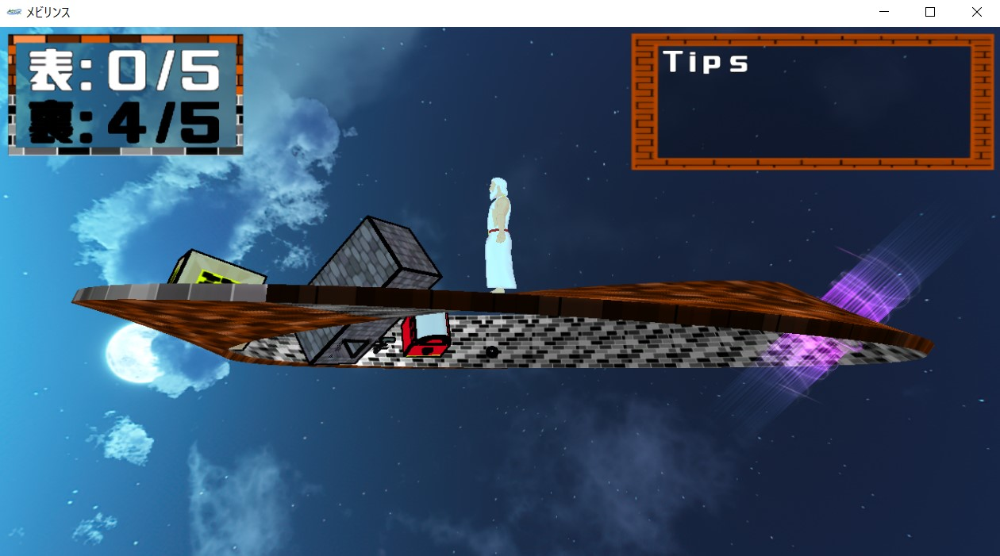
<br>


▼ステージ7,8
<br>
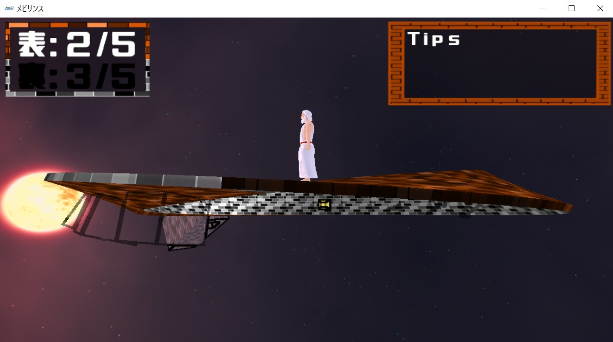
<br>


▼ステージ9
<br>
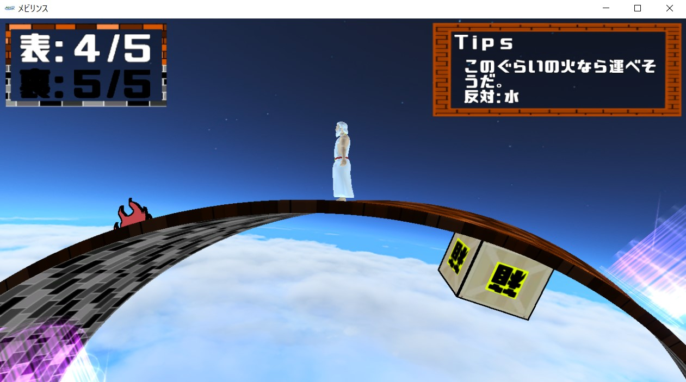
<br>

<div style="text-align: right;">
<br>

[目次へ](#目次)
</div>

### 8.1.2. IBLの追加

&emsp;スカイキューブマップの変更をより効果的にするためにIBL（イメージベースドライティング [Image-Based Lighting]）の機能を追加した。<br>
&emsp;改変前も、ライティングにスカイキューブマップのカラーの影響を受けていたが、よりきれいにスカイキューブマップのカラーが映り込むような計算にして、更にスカイキューブマップに依って明るさが変化するため明るさもステージごとに調整できるようにした。<br>
&emsp;IBLの手順は以下の通りである。

1. まずはCPU側（C++）の処理で、コンスタントバッファを利用して、カメラの視点**eyePos**、明るさ**luminance**、どのくらい空のカラーの影響を受けるかの**IBLRate**の値をCPU側からGPU側に渡す。
2. 次にシェーダーリソースビューとしてスカイキューブマップをCUP側からGUP側に渡す。
3. GPU側（hlsl）の処理で、描画するピクセルのワールド座標**posInWorld**から視点**eyePos**へのベクトル**fromEyeV**を計算する。（fromEyeV = psInWorld - eyePos）

    <br>
    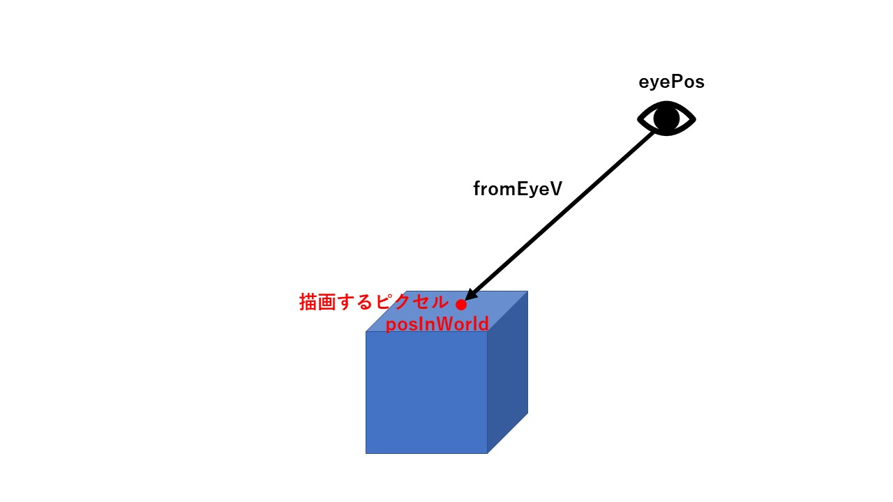
    <br>

4. fromEyeVとピクセルの法線**normal**とhlslのreflect関数を使って、反射ベクトル**refV**を求める。（refV = reflect(fromEyeV, normal)）

    <br>
    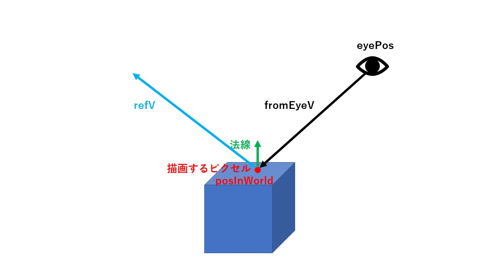
    <br>

5. スカイキューブマップのテクスチャをrefVを使ってサンプリングしてカラーを取ってくる。

    <br>
    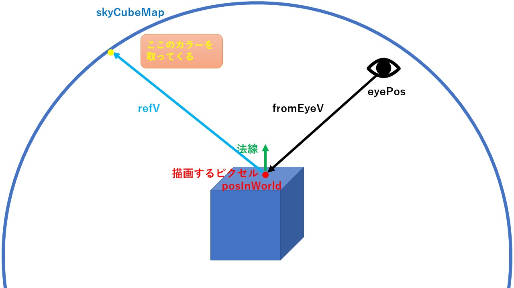
    <br>

  * ただし、普通にカラーを持ってくると、金属のように空のカラーがモデルにそのまま映り込んでしまい、気持ちの悪いモデルになってしまう。そこで、**MipMap**を利用してぼんやりと空のカラーが映り込むようにした。

      ▼普通のスカイキューブマップテクスチャを使用
      <br>
      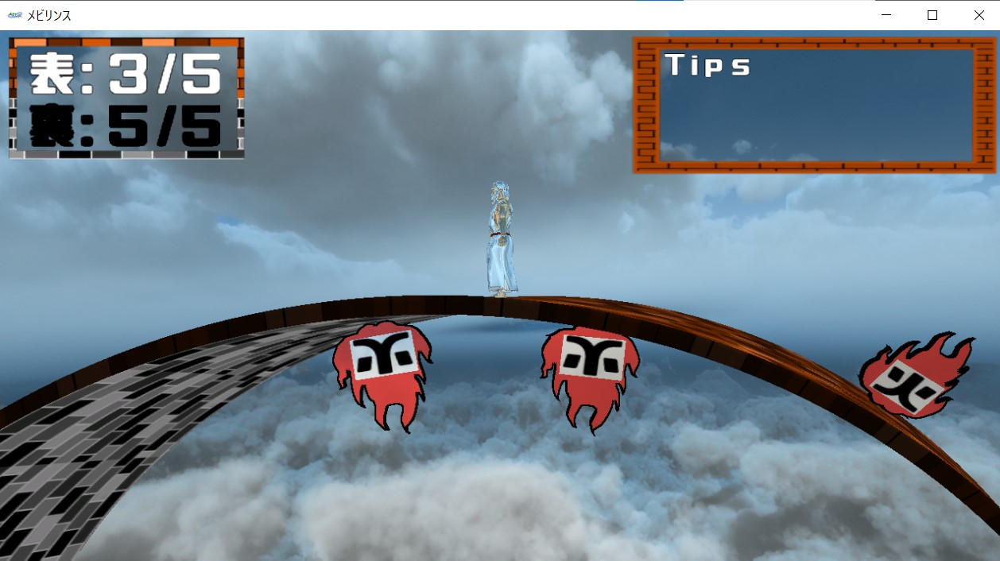
      <br>

      ▼MIPレベル12のスカイキューブマップテクスチャを使用
      <br>
      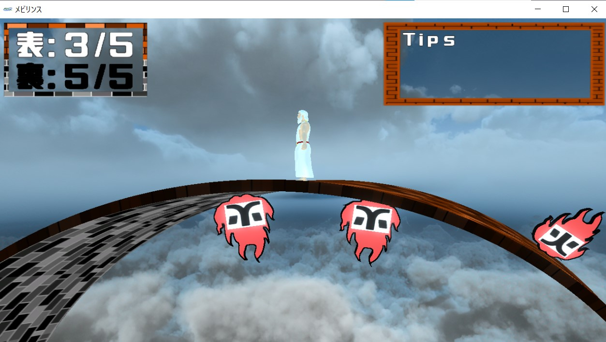
      <br>

   * MipMapとは、あらかじめテクスチャの縮小版のテクスチャをいくつか計算し、最適化した画像群のことである。描画する時、描画サイズが大きいときは本来の高解像度のテクスチャが使用され、描画サイズが小さいほど縮小版のテクスチャに差し替えられる。これにより処理負荷を軽減する、という用途で使われる。

      ▼MIPレベル1のスカイキューブマップテクスチャ
      <br>
      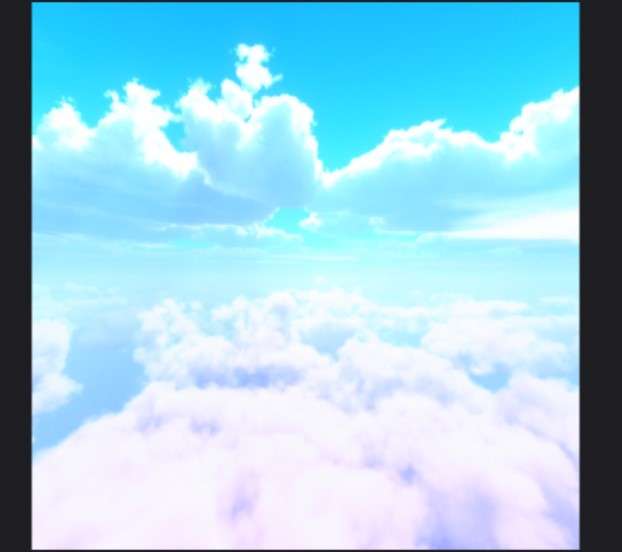
      <br>

      ▼MIPレベル7のスカイキューブマップテクスチャ
      <br>
      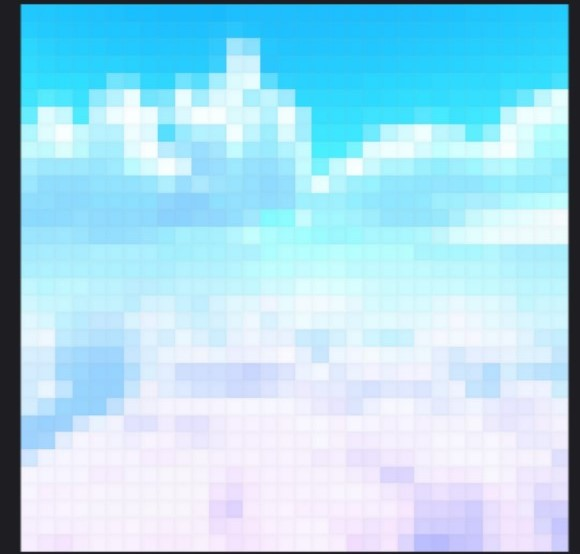
      <br>

6. 最後に**luminance**と**IBLRate**の値を調節する。使用するスカイキューブマップのカラーによって、明るいカラーや暗いカラー、映り込みが目立つカラーや目立たないカラーがあり、それらを調節するためである。luminanceで明るさ、IBLRateで空のカラーの影響をどのくらい受けるかを調節する。

  * ステージ1,2のスカイキューブマップ
  
      | luminance | IBLRate |
      |---|---|
      | 1.1 | 0.4 |

    ▼明るく、映り込みが目立つ空のカラー
    <br>
    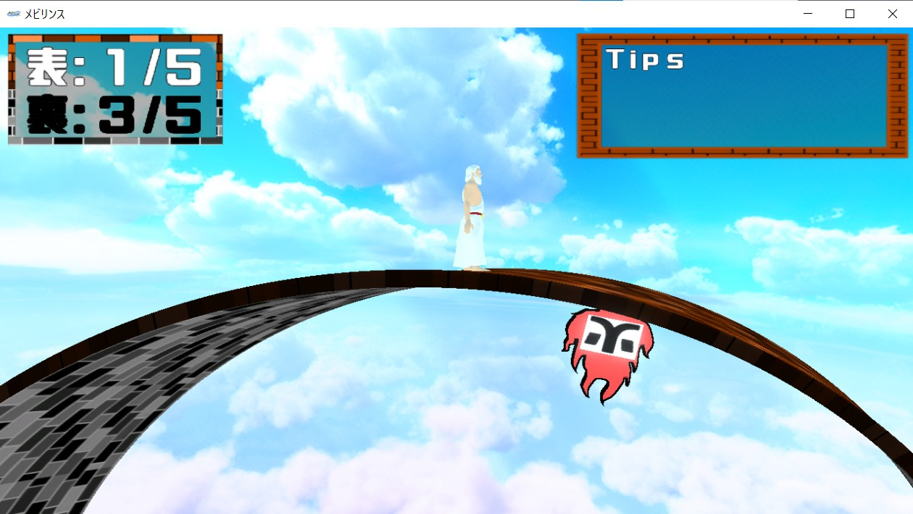
    <br>
  
  * ステージ7,8のスカイキューブマップ

      | luminance | IBLRate |
      |---|---|
      | 3.0 | 0.8 |

    ▼暗く、映り込みが目立たない空のカラー
    <br>
    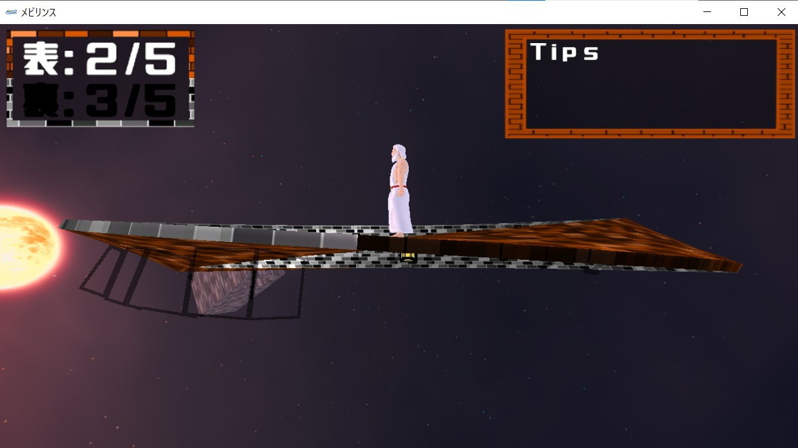
    <br>


<div style="text-align: right;">
<br>

[目次へ](#目次)
</div>

### 8.1.3. ディファードレンダリングとフォワードレンダリングのハイブリッドレンダリングエンジンの追加

&emsp;改変前はフォワードレンダリングのみでライティングをしていたが、改変後はディファードレンダリングとフォワードレンダリングを組み合わせたライティングになっている。<br>
&emsp;フォワードレンダリングは、モデルを描画するときに一緒にライティングも行うレンダリング方法だが、ディファードレンダリングはモデルを描画するときにライティングに必要なデータを書き出し、全部書き出し終わった後でライティングを行う方法だ。これにより、モデルの奥に隠れた見えないモデルの不必要なライティングをしなくて済む。<br>
&emsp;しかし、ディファードレンダリングでは半透明描画ができない。半透明描画をするにはアルファブレンディングを行わなければならない。だが、ライティングに必要なデータを描き込むときに、アルベドカラーなどはアルファブレンディングできるが、法線などアルファブレンディングできないデータがあり、後にライティングするときにおかしな計算になってしまうためである。<br>
&emsp;これを解決するために、ディファードレンダリングとフォワードレンダリングを組み合わせたライティングを行う。ディファードレンダリングを行った後、半透明描画をするモデルをフォワードレンダリングで描画する。<br>
&emsp;詳しい手順は以下の通りである。

1. まずは、MRT（MultiRenderingTarget）という機能を使い、G-Bufferと呼ばれる複数枚のテクスチャにライティングに必要なデータを書き出していく。このゲームでは、7つのG-Bufferを作成しており、それぞれ、アルベドカラー、法線、ビュー座標系の法線、ワールド座標系の座標、ライトビュープロジェクション座標系の座標、プロジェクション座標計の座標、自己発光色の内容になっている。
  
    <br>
    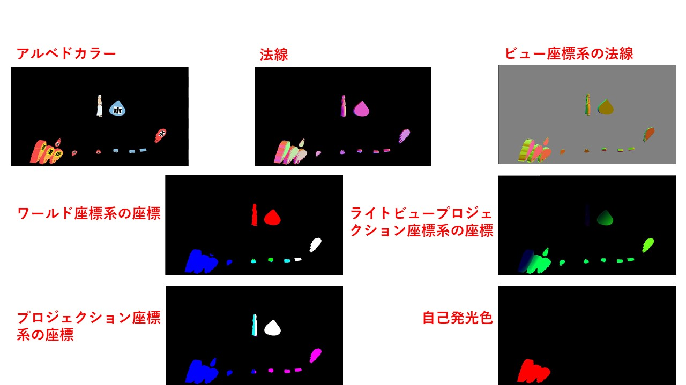
    <br>

2. 作成したG-Bufferを、ディファ―ドライティングを行うスプライトのシェーダーリソースビューに登録する。
3. G-BufferをUVでサンプリングして、そのピクセルのライティングに必要なデータを取り出して、ライティングを行う。ここでディファードレンダリングの処理は終了

    <br>
    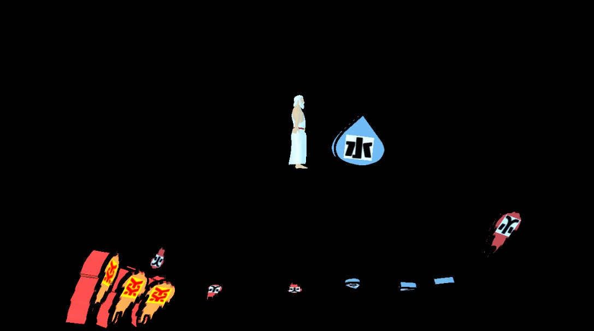
    <br>

4. ここからフォワードレンダリングを行う。フォワードレンダリングを行う際、深度ステンシルビューを、G-Bufferを作成した時に作られた深度ステンシルビューに設定する。これにより、後から描画してもモデルの前後関係が正しく描画される。

    <br>
    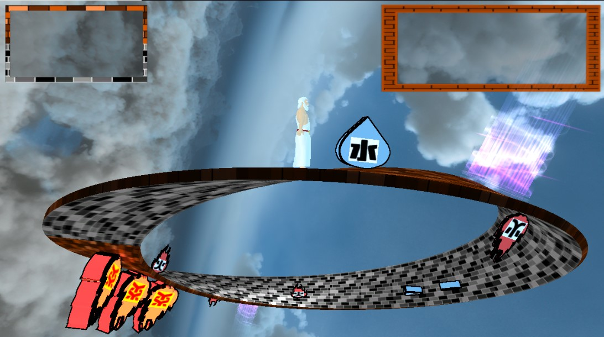
    <br>

<div style="text-align: right;">
<br>

[目次へ](#目次)
</div>

## 8.2. 比較内容２（リファクタリング）

### 8.2.1. マジックナンバーの取り除き

&emsp;マジックナンバーとは、ソースコード内に直に書き込まれた数値である。マジックナンバーは書いた本人は、どんな目的の数値なのか分かっても、他の人から見たら何の数値なのかわからない。更に、書いた本人すらも時間が立てば忘れてしまい、何に数値かわらかなくなるかもしれない。<br>
&emsp;また、同じ目的で同じ数値のマジックナンバーが複数個所ある場合、その数値を変更する時、一つ一つ変更していかなければならない。一部変更し忘れるミスをしてしまう危険性もある。<br>
&emsp;以上のことからマジックナンバーを使用すると、可読性と保守性を下げてしまう。そのため、マジックナンバーを定数や列挙型に置き換えて、一か所にまとめておく改変を行った。<br>

▼Player.cppの一部のコード
<br>
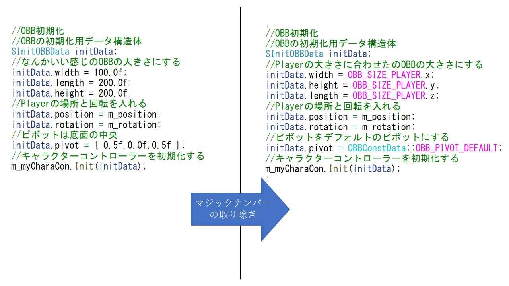
<br>

<div style="text-align: right;">
<br>

[目次へ](#目次)
</div>

### 8.2.2. namespaceの追加

&emsp;改変前はグローバルな名前空間に直書きだったコードを、改変後ではnamespaceの中に、コードの種類ごとに整理して入れた。名前空間中に入れることで、変数などの識別名の競合を限定的なものにすることができる。自分だけなら、識別名の競合ぐらい気をつけておけば大丈夫だと思うかもしれないが、他の人と作業するする時や、ライブラリを利用するときなどに、競合してしまう可能性が出てくる。<br>

▼GameCamera.hの一部のコード
<br>
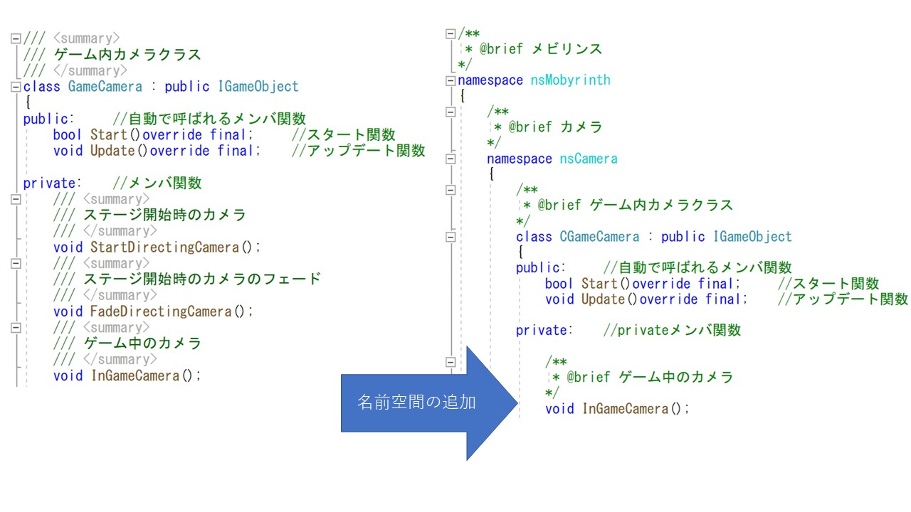
<br>

<div style="text-align: right;">
<br>

[目次へ](#目次)
</div>

### 8.2.3. 変数の初期化

&emsp;変数を初期化しなければ、想定外のエラーが出てくる可能性がある。初期化せずに宣言だけをした変数にもアドレスは割り振られ、そのアドレスには、宣言前に使用していたデータが残っている可能性がある。初期化していない変数を使用してしまったときに、何の値か分からないデータを使用することとなり、想定外のエラーが出てくる可能性がある。
&emsp;改変前も気を付けていたが、初期化を忘れているところがあったため、修正した。<br>

▼Player.hの一部のコード
<br>
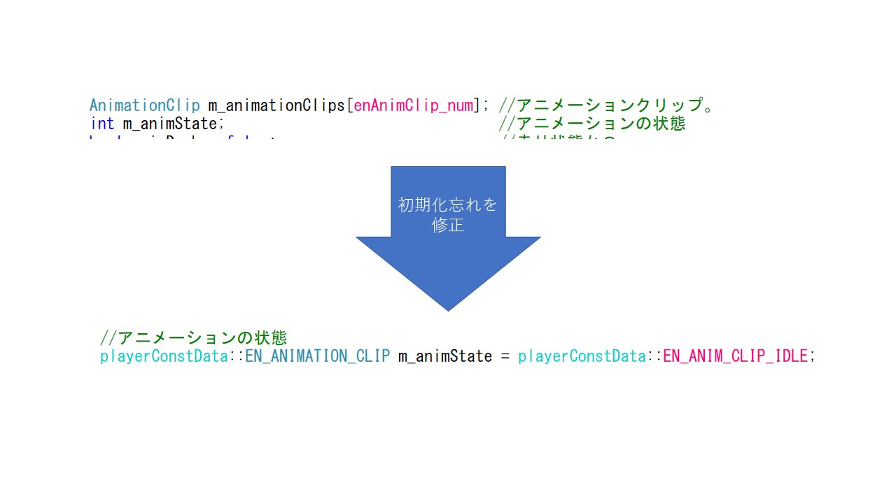
<br>


<div style="text-align: right;">
<br>

[目次へ](#目次)
</div>

### 8.2.4. 暗黙の型変換をなくす

&emsp;暗黙の型変換は、どのように変換されるか理解しておけば問題ないように思えるが、ビルドするときに出力ウィンドウに警告が発生する。暗黙の型変換は注意しておかないと大量に発生してしまい、出力ウィンドウを圧迫してしまう。その結果、重要な警告を見逃してしまいやすくなってしまう。<br>
&emsp;そのため、明示的にキャストを書いたり、関数のオーバーロードを増やしたりして、暗黙の型変換をなくすようにした。

▼暗黙の型変換による警告と警告がでた関数
<br>
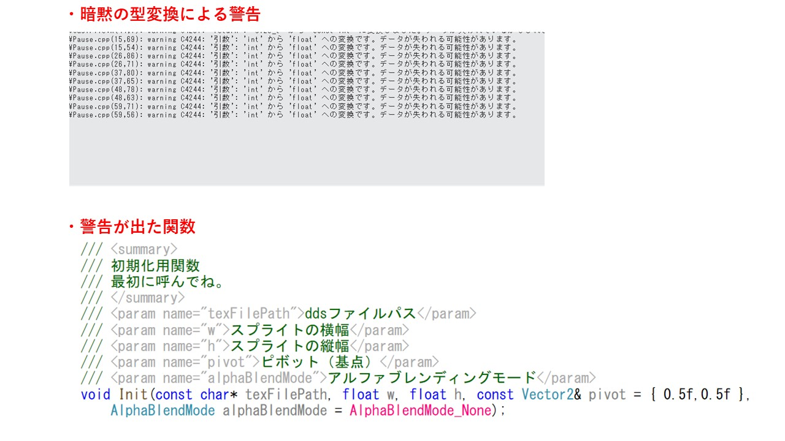
<br>

▼関数のオーバーロードを増やし、暗黙の型変換を防ぐ
<br>
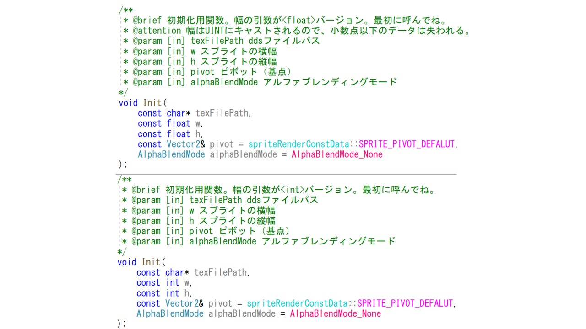
<br>

<div style="text-align: right;">
<br>

[目次へ](#目次)
</div>

### 8.2.5. 処理の長い関数の分割

&emsp;一つの関数の処理が長いと、見づらい上に、いろんな機能が一つの関数で行われているため何をやっている関数なのか分かりずらい。処理の長い関数は、処理ごとに細かく分けて関数を分割することで、バグが発生した時も確認する部分が限定でき、可読性と保守性に優れる。<br>
&emsp;改変前は、気にせず同じ関数内にいろんな処理を書いてしまい100行を超える関数が沢山あったが、改変後は、処理の長い関数は、処理ごとに細かく関数を分割した。

▼Player.cppのStart関数
<br>
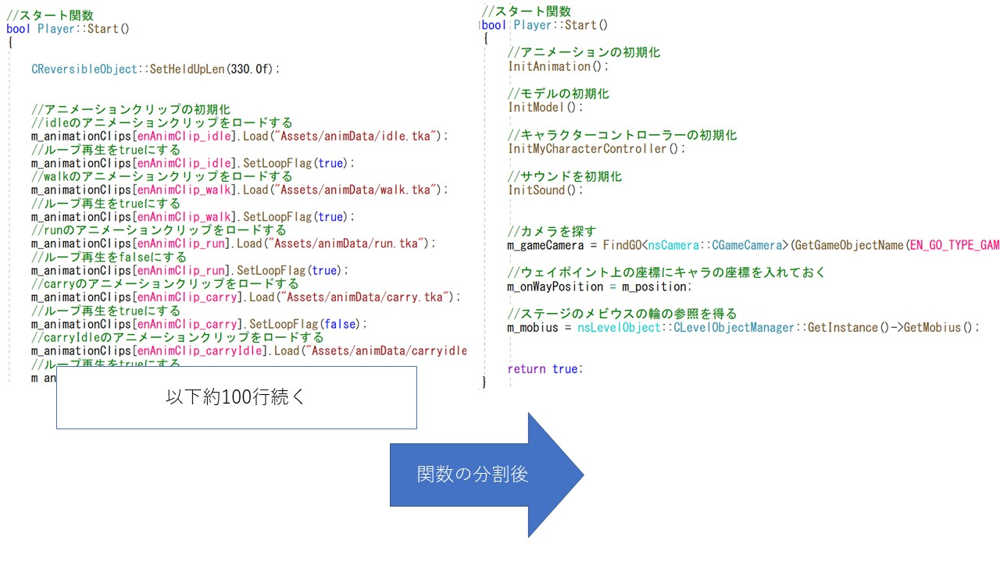
<br>

<div style="text-align: right;">
<br>

[目次へ](#目次)
</div>

### 8.2.6. dynamic_castによるダウンキャストの取り除き

&emsp;dynamic_castを使えば比較的安全にダウンキャストを行うことができるが、dynamic_cast事態の処理速度が遅いためあまり使用すべきではない。<br>
&emsp;そのため、改変前では、dynamic_castでダウンキャストが成功した時にだけその派生クラスにしかないメンバ関数を呼んでいたが、改変後では、基底クラスに何も処理をしない仮想関数を作り、目的の派生クラスだけでオーバーライドを行うことで解決した。

▼Player.cppのStart関数
<br>
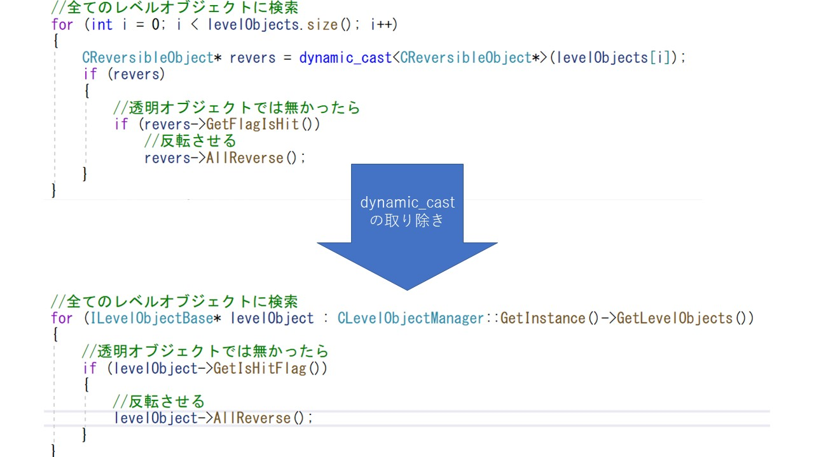
<br>

<div style="text-align: right;">
<br>

[目次へ](#目次)
</div>